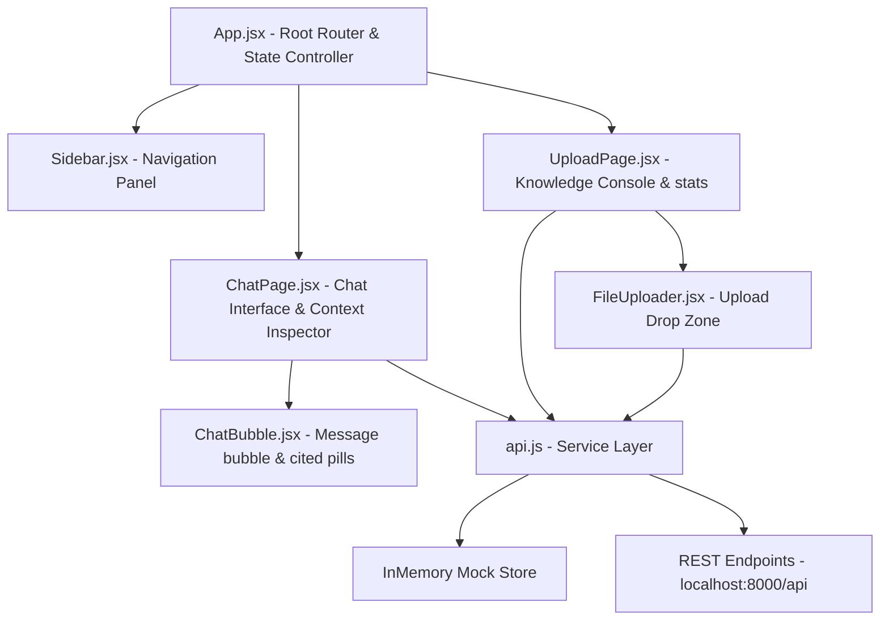
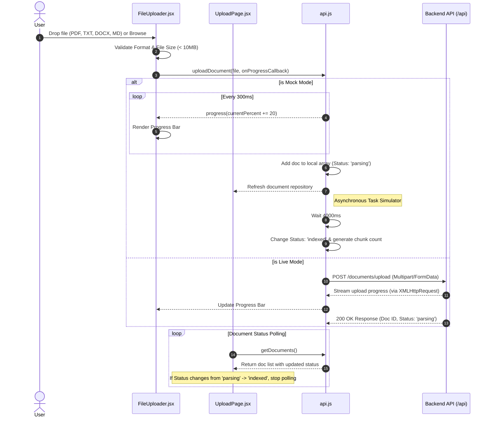
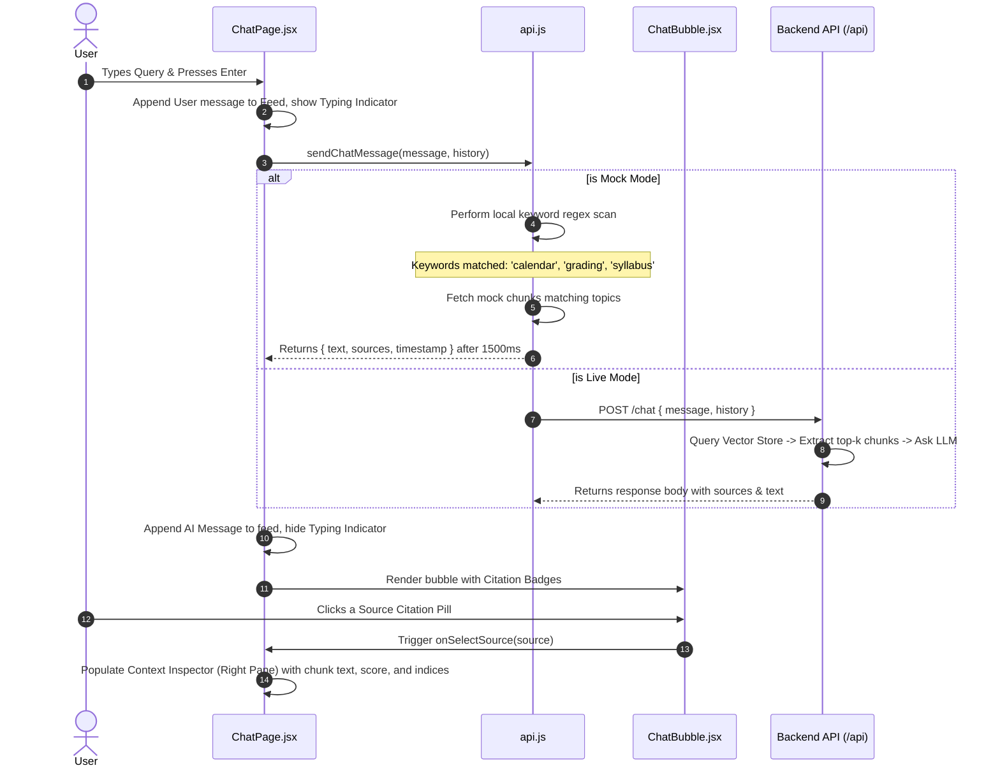

# QueryNest Project Workflow & Architecture Document

QueryNest is a modern, high-fidelity React frontend dashboard configured for a **Retrieval-Augmented Generation (RAG)** chatbot system. The console facilitates two main operations: **Knowledge Base Ingestion (Upload)** and **Semantic Chat Retrieval (Chat & Inspection)**.

---

## 1. Overall System Architecture
The application runs on React 18+ and Vite. It is designed to work in two modes:
1. **Mock Mode (Offline Fallback):** Simulates uploading, parsing, indexing, and context-retrieval completely client-side.
2. **Live Mode (Connected):** Connects to a backend server running at `http://localhost:8000/api` to perform real-time extraction, indexing, and LLM-powered context matching.

### High-Level Component Relationship Diagram


---

## 2. Page & Component State Tree

### `App.jsx`
- **`activeTab` (State: `'upload' | 'chat'`):** Drives the main view switcher.
- **`mockMode` (State: `boolean`):** Checked every 1 second by polling `api.getMockMode()`.
- **Layout Structure:**
  - Includes `<Sidebar activeTab={activeTab} setActiveTab={setActiveTab} mockMode={mockMode} />`
  - Swaps between `<UploadPage onStartChat={() => setActiveTab('chat')} />` and `<ChatPage />`.

### `Sidebar.jsx`
- **Tab Selection Buttons:** Switches `activeTab` to `'upload'` (Knowledge Base Console) or `'chat'` (AI Chatbot page).
- **Branding & Layout:** Renders the system brand name, logo icon, and version footers. Supports horizontal compaction (responsive behavior) on mobile/narrow viewports.

---

## 3. Ingestion & Indexing Workflow (File Upload)
The upload flow validates local files, handles upload progress, updates repository databases, and tracks status changes.

### Sequence Diagram


### Detailed steps:
1. **Selection & Validation:** The user drags a file into the drop-zone. `FileUploader.jsx` checks the extension against allowed formats: `.pdf`, `.txt`, `.docx`, `.md` and ensures the file size does not exceed `10MB`.
2. **Uploading Phase:**
   - **Mock Mode:** Iterates progress state from `10%` to `100%` in 300ms chunks to mimic upload latency.
   - **Live Mode:** Dispatches a multipart `FormData` post via an standard `XMLHttpRequest` request to `${API_BASE_URL}/documents/upload`, subscribing to the `xhr.upload.onprogress` handler to retrieve exact bytes sent.
3. **Parsing Phase:** Once received, the document status is initially flagged as `parsing`. In Mock mode, a background timeout simulates a document parser running for 4 seconds, converting the status to `indexed` and calculating mock text chunks.
4. **Repository Refresh:** The `UploadPage.jsx` sets an interval to query `api.getDocuments()` every 3 seconds if there are active files with `parsing` status. Once all files transition to `indexed`, polling pauses.

---

## 4. Semantic Chat & Context Inspection Workflow
This flow demonstrates how user queries query document indices (RAG) and present citations.

### Sequence Diagram


### Detailed steps:
1. **Prompt Entry:** The user types a query (e.g. *"What are the semester schedules?"*) into the text box and submits it.
2. **Thinking State:** The feed immediately lists the user's message and renders an animated thinking block containing three bouncing dots (`.typing-dot`).
3. **Retrieval Processing:**
   - **Mock Mode:** Performs regex matching on the input. For instance, matches for *"holiday"* or *"calendar"* fetch metadata and mock passage content representing `academic_calendar_2026.pdf`. It returns structured source objects containing:
     - `fileName`: The source file.
     - `chunkIndex`: The document chunk number.
     - `content`: The raw text fragment.
     - `score`: The simulated cosine similarity percentage.
   - **Live Mode:** Dispatches a JSON body containing `{ message, history }` to `/api/chat`. The backend performs database similarity calculations to get relevant document segments, feeds them to the LLM, and returns the response.
3. **Attribution pills:** When sources are present in the response, they are rendered underneath the message inside `<ChatBubble />` as action pills showing similarity ratios (e.g., `88%`).
4. **Context Inspector:** Clicking a pill sets the `selectedSource` state in `ChatPage.jsx`. This immediately displays the exact raw text chunk matching the query in the **Context Inspector** right-side panel, including its exact indexing number and confidence level.

---

## 5. Dual-Mode Connection Resilience Layer
The service layer defined in [`api.js`](file:///c:/Users/DELL/Desktop/projects/AI-query-retraival/my-react-app/src/services/api.js) automatically transitions between mock files and backend calls:

```javascript
let useMock = true; // Fallback to mock API

export async function getDocuments() {
  if (useMock) {
    await new Promise(resolve => setTimeout(resolve, 800)); // Simulates delay
    return [...mockDocuments];
  }
  try {
    const response = await fetch(`${API_BASE_URL}/documents`);
    if (!response.ok) throw new Error('Failed to fetch documents');
    return await response.json();
  } catch (error) {
    console.warn('API error, falling back to mock:', error);
    useMock = true; // Fallback activated
    return getDocuments(); // Automatically retry with mock database
  }
}
```
This wrapper pattern is implemented on all endpoints: `getDocuments()`, `uploadDocument()`, `deleteDocument()`, and `sendChatMessage()`. If the server goes offline or has a CORS issue, the application handles it silently and retains normal dashboard interactivity.
