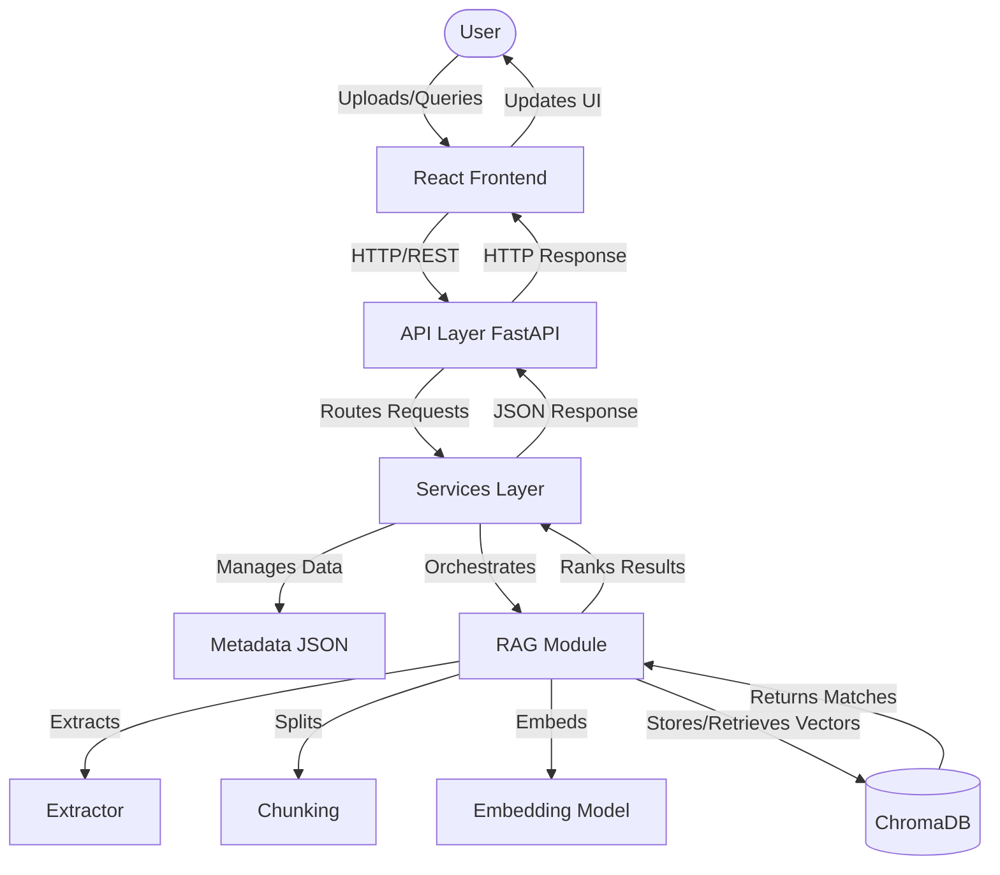
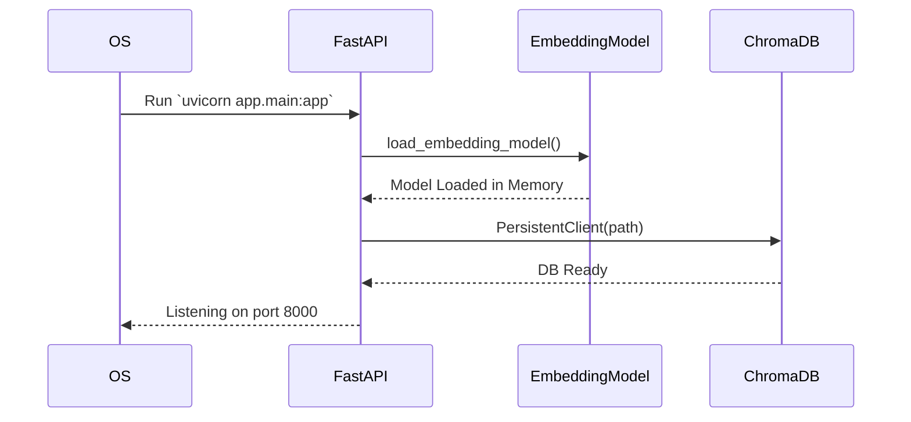
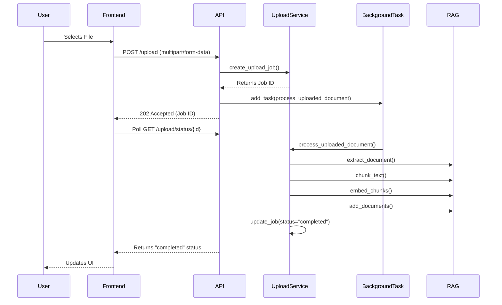
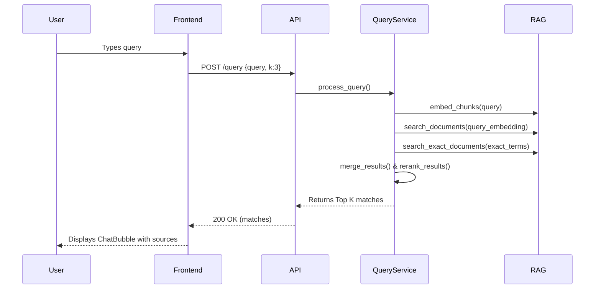
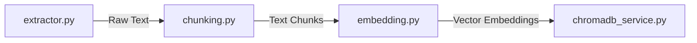
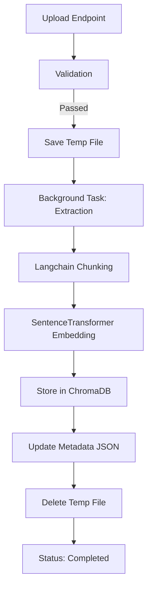
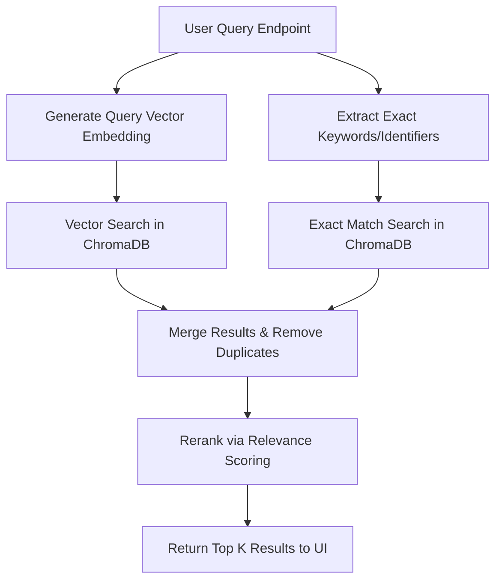

# AI-Based Knowledge Retrieval Platform with Query Resolution System  

## SECTION 1 — PROJECT OVERVIEW

### Project Objective
The objective of this project is to provide an AI-powered Knowledge Retrieval Platform that allows users to upload documents (PDF, DOCX, TXT, CSV) and interactively query them using a Retrieval-Augmented Generation (RAG) approach.

### Problem Statement
Organizations and individuals often struggle to quickly extract meaningful and relevant information from large repositories of unstructured documents. Traditional keyword-based search is limited and lacks semantic understanding, making it difficult to answer complex queries based on specific proprietary data.

### Why Retrieval-Augmented Generation (RAG) is used
RAG bridges the gap between the internal knowledge base of a large language model and external proprietary data. By storing document chunks in a vector database and retrieving semantically matching chunks at query time, RAG provides grounded, accurate context for the AI, reducing hallucinations and ensuring the responses are directly derived from the uploaded documents.

### End-to-End Workflow
1. **Upload:** A user uploads a document via the React frontend.
2. **Extraction & Chunking:** The FastAPI backend extracts text from the document and splits it into smaller chunks.
3. **Embedding:** The chunks are converted into semantic vector embeddings using a SentenceTransformer model.
4. **Storage:** The embeddings and original text chunks are stored in ChromaDB, while metadata is saved in a local JSON file.
5. **Querying:** The user submits a query via the chat interface.
6. **Retrieval:** The backend embeds the query, searches ChromaDB for the most relevant document chunks, and returns them to the frontend with relevance scores.

### Overall System Architecture
The system follows a clean client-server architecture. The frontend is a React Single Page Application (SPA) built with Vite, handling UI state and API interactions. The backend is a FastAPI Python application responsible for document processing, RAG operations, and API routing. They communicate over REST API.

---

## SECTION 2 — TECHNOLOGY STACK

### Backend
| Technology | Description |
|---|---|
| Python 3 | Core programming language for the backend |
| FastAPI | High-performance async web framework for building APIs |
| Uvicorn | ASGI server for running FastAPI |

### Frontend
| Technology | Description |
|---|---|
| React 19 | UI library for building the interactive frontend |
| Vite | Fast build tool and development server |
| Vanilla CSS | Used for all styling (index.css, App.css) |

### Libraries
| Technology | Description |
|---|---|
| pypdf | Library for extracting text from PDF files |
| python-docx | Library for extracting text from DOCX files |
| pandas | Data manipulation library used for parsing CSV files |
| python-multipart | Needed by FastAPI to parse form data for file uploads |

### Frameworks
| Technology | Description |
|---|---|
| LangChain | Framework used for text splitting (RecursiveCharacterTextSplitter) |
| Sentence Transformers | Framework for generating vector embeddings |

### Database
| Technology | Description |
|---|---|
| Local JSON | Used for lightweight document metadata persistence (documents.json) |

### Vector Database
| Technology | Description |
|---|---|
| ChromaDB | Open-source embedding database for storing and querying vector data |

### Embedding Model
| Technology | Description |
|---|---|
| all-MiniLM-L6-v2 | Lightweight, fast embedding model from SentenceTransformers |

### Document Processing Libraries
| Technology | Description |
|---|---|
| pypdf, python-docx, pandas, langchain-text-splitters | Stack for parsing multiple file formats and chunking texts |

### Development Tools
| Technology | Description |
|---|---|
| Oxlint | Fast linter used for checking frontend code |

### Build Tools
| Technology | Description |
|---|---|
| Vite | Frontend build tool |
| npm | Node package manager |

---

## SECTION 3 — COMPLETE PROJECT STRUCTURE

```text
AI-Based Knowledge Retrieval Platform with Query Resolution System/
├── backend/                  # Backend FastAPI application
│   ├── app/                  # Main application package
│   │   ├── __init__.py       # Package marker
│   │   ├── main.py           # FastAPI application entry point
│   │   ├── api/              # API Routers layer
│   │   │   ├── __init__.py   # Package marker
│   │   │   ├── documents.py  # Endpoints for document management
│   │   │   ├── health.py     # Endpoints for health checks
│   │   │   ├── query.py      # Endpoints for query processing
│   │   │   └── upload.py     # Endpoints for file uploads
│   │   ├── core/             # Core configurations
│   │   │   ├── __init__.py   # Package marker
│   │   │   └── config.py     # Centralized configuration variables
│   │   ├── models/           # Pydantic data models
│   │   │   ├── __init__.py   # Package marker
│   │   │   ├── request_models.py   # Request validation models
│   │   │   └── response_models.py  # Response validation models (empty)
│   │   ├── rag/              # Retrieval-Augmented Generation logic
│   │   │   ├── __init__.py         # Package marker
│   │   │   ├── chromadb_service.py # Vector database operations
│   │   │   ├── chunking.py         # Text chunking logic
│   │   │   ├── embedding.py        # Model loading and embedding generation
│   │   │   └── extractor.py        # Text extraction for PDF, DOCX, TXT, CSV
│   │   ├── services/         # Business logic layer
│   │   │   ├── __init__.py         # Package marker
│   │   │   ├── document_service.py # Logic for document management
│   │   │   ├── metadata_service.py # JSON persistence and status tracking
│   │   │   ├── query_service.py    # Hybrid retrieval pipeline logic
│   │   │   └── upload_service.py   # Orchestration of file processing
│   │   └── utils/            # Shared utilities
│   │       └── __init__.py   # Package marker
│   ├── chroma_db/            # Persistent storage directory for ChromaDB
│   ├── metadata/             # Persistent storage for metadata JSON
│   ├── uploads/              # Temporary storage for uploaded files
│   ├── requirements.txt      # Python dependencies
│   └── sample.txt            # Sample file for testing
├── Frontend/                 # React frontend application
│   ├── public/               # Public static assets
│   ├── src/                  # Source code for React app
│   │   ├── assets/           # Images and media (hero.jpg)
│   │   ├── components/       # Reusable React components
│   │   │   ├── ChatBubble.jsx   # Renders individual chat messages
│   │   │   ├── FileUploader.jsx # Drag & drop file upload widget
│   │   │   ├── Footer.jsx       # Global page footer
│   │   │   └── Sidebar.jsx      # Navigation sidebar
│   │   ├── pages/            # Page-level components
│   │   │   ├── ChatPage.jsx     # AI Chatbot interface
│   │   │   └── UploadPage.jsx   # Knowledge base management interface
│   │   ├── services/         # Frontend business logic and APIs
│   │   │   └── api.js        # Functions for backend API communication
│   │   ├── App.css           # Global layout styling
│   │   ├── App.jsx           # Main React component and router substitute
│   │   ├── index.css         # CSS design system and variables
│   │   └── main.jsx          # React DOM entry point
│   ├── .gitignore            # Git ignore rules
│   ├── .oxlintrc.json        # Oxlint configuration
│   ├── index.html            # Vite HTML entry point
│   ├── package-lock.json     # Node dependencies lockfile
│   ├── package.json          # Node dependencies and scripts
│   ├── vite.config.js        # Vite configuration
│   └── workflow.md           # Documentation for frontend workflows
├── .git/                     # Git repository
├── .gitignore                # Git ignore rules for root
└── README.md                 # Project documentation
```

---

## SECTION 4 — HIGH LEVEL ARCHITECTURE



---

## SECTION 5 — FRONTEND ARCHITECTURE

### Folder Structure
- `src/components/`: Reusable, stateless or tightly-scoped UI components.
- `src/pages/`: Stateful, high-level views that assemble components into screens.
- `src/services/`: Logic for external communication (API client).
- `src/assets/`: Static media like images.

### Components
- `ChatBubble.jsx`: Renders messages from both the user and the bot, handling UI for time formatting, "AI Assistant" avatars, and the source attribution pill buttons.
- `FileUploader.jsx`: Provides a drag-and-drop interface, handles the `multipart/form-data` upload API call, tracks progress, and polls the backend for background processing status.
- `Footer.jsx`: A simple presentational footer displaying links and stack info.
- `Sidebar.jsx`: The left-side navigation allowing switching between "Upload Documents" and "AI Chatbot".

### Pages
- `ChatPage.jsx`: Manages the chat history state, handles message sending, controls the typing indicator, and contains the "Context Inspector" side panel to view raw source chunks.
- `UploadPage.jsx`: Displays statistics regarding the uploaded documents (total size, chunks, etc.), mounts the `FileUploader`, and lists all currently uploaded documents with options to delete them.

### Services
- `api.js`: Contains all `fetch` wrapper functions to communicate with the FastAPI backend (`getDocuments`, `uploadDocument`, `getUploadStatus`, `deleteDocument`, `sendChatMessage`). Provides a mock mode for UI testing without the backend.

### Hooks
The frontend heavily utilizes standard React hooks like `useState`, `useEffect`, and `useRef` directly within components to manage UI states, polling intervals, and scrolling behaviors. No custom external hooks are defined.

### Assets
Contains static files like `hero.jpg` which is used as the application logo in the `Sidebar.jsx`.

### Styles
- `index.css`: Houses CSS custom properties (variables) for colors, glassmorphism effects, shadows, animations, and global reset styles.
- `App.css`: Defines layout rules for the `main-app` grid and `sidebar` widths.

### Utilities
Utilities like date formatting (`formatDate`) and byte formatting (`formatBytes`) are localized within the specific components (`UploadPage.jsx`, `ChatBubble.jsx`) that need them.

### Reusable Components
`ChatBubble` is reusable across any chat interface. `FileUploader` handles its own complex state and can be embedded anywhere a file upload is needed.

### Routing
No traditional routing library (like React Router) is used. Instead, conditional rendering is managed via the `activeTab` state in `App.jsx`, switching between `UploadPage` and `ChatPage`.

### State Management
State is localized to components using React's `useState`. High-level state (like the active tab) is held in `App.jsx` and passed down as props.

### API Communication
All backend interaction is abstracted into `services/api.js`. It utilizes the native `fetch` API for JSON requests and `XMLHttpRequest` for file uploads to support upload progress tracking.

### Styling Approach
The project uses vanilla CSS with a design system based on CSS variables (`var(--accent-purple)`, etc.). It employs a "Glassmorphism" aesthetic with semi-transparent backgrounds and backdrops.

### Component Hierarchy
```text
App
├── Sidebar
└── Main Content
    ├── UploadPage (if activeTab === 'upload')
    │   ├── FileUploader
    │   └── Footer
    └── ChatPage (if activeTab === 'chat')
        ├── ChatBubble (list)
        └── Context Inspector
```

---

## SECTION 6 — BACKEND ARCHITECTURE

### `app/`
The main Python package containing all application logic.

### `app/api/`
The presentation layer for the backend. Contains FastAPI routers which only handle HTTP requests and responses, delegating business logic to services.
- `documents.py`: Endpoints to get and delete indexed documents.
- `health.py`: Simple root endpoint to verify API health.
- `query.py`: Endpoint for sending search queries.
- `upload.py`: Endpoints for uploading files and checking job statuses.

### `app/services/`
The business logic layer.
- `document_service.py`: Orchestrates fetching document lists and deleting documents, linking ChromaDB deletion with Metadata JSON deletion.
- `metadata_service.py`: Handles reading and writing to `documents.json` and manages in-memory processing job states.
- `query_service.py`: Executes the hybrid retrieval pipeline (semantic search + exact matching) and scores/reranks chunks.
- `upload_service.py`: Coordinates the long-running upload pipeline (saving file, extracting, chunking, embedding, saving to ChromaDB).

### `app/rag/`
The core AI processing modules.
- `chromadb_service.py`: Connects to ChromaDB, manages collections, inserts chunks, and runs vector and exact keyword searches.
- `chunking.py`: Uses LangChain to split large texts into 500-character overlapping chunks.
- `embedding.py`: Loads the SentenceTransformer model and generates vector arrays.
- `extractor.py`: Uses `pypdf`, `python-docx`, and `pandas` to read raw text from files.

### `app/models/`
Pydantic data models for request/response validation.
- `request_models.py`: Validates input schemas (e.g., `QueryRequest`).
- `response_models.py`: Currently empty, can be used for typed responses.

### `app/core/`
- `config.py`: Centralizes constants, file paths, and environment variables like `UPLOAD_FOLDER` and `CHROMA_DB_PATH`.

### `app/utils/`
Contains `__init__.py`. Placeholder for shared utilities.

---

## SECTION 7 — APPLICATION FLOW

### Application Startup


### Document Upload & Processing


### Query Processing


---

## SECTION 8 — REQUEST FLOW

1. **Frontend:** React makes an HTTP request via `services/api.js`.
2. **API Layer (`main.py`):** The request enters FastAPI, passes through CORS middleware, and is routed to the appropriate APIRouter.
3. **FastAPI Router (`app/api/*`):** The router validates the HTTP request (e.g., checks if a file is attached or validates JSON body via Pydantic).
4. **Service Layer (`app/services/*`):** The router calls a service function, passing only the necessary data. The service handles the business logic.
5. **RAG Module (`app/rag/*`):** If the service requires AI operations, it calls the `rag/` modules to extract text, chunk it, or generate embeddings.
6. **ChromaDB / Metadata JSON:** Data is read from or written to ChromaDB (for vectors) and `documents.json` (for job states and metadata).
7. **Response:** The Service Layer returns standard Python dictionaries back to the Router. The Router implicitly converts these to JSON and returns them to the Frontend.

---

## SECTION 9 — FRONTEND COMPONENT FLOW

- **How components communicate:** The application uses prop drilling to pass down state and callbacks. For instance, `App.jsx` passes `setActiveTab` to `Sidebar.jsx`, and `onStartChat` to `UploadPage.jsx` which passes it further if needed.
- **How API requests are made:** Components call asynchronous functions inside `services/api.js` inside a `try/catch` block.
- **How responses update UI:** Successful API calls resolve and trigger a React `setState` update, re-rendering the component with the new data (e.g., appending a message to the chat array).
- **How loading states are handled:** Local boolean state variables (like `isTyping` in `ChatPage.jsx` or `loading` in `UploadPage.jsx`) determine whether to show spinners or typing indicators.
- **How errors are handled:** `services/api.js` checks `response.ok` and throws an Error with the backend's detail message. The components catch this error and update an `errorMessage` state, which is displayed to the user.

---

## SECTION 10 — BACKEND ROUTERS

| Router | Method | Route | Input | Output | Services Used |
|---|---|---|---|---|---|
| **Health** | GET | `/` | None | JSON status msg | None |
| **Documents**| GET | `/documents` | None | List of metadata objects | `get_all_documents` |
| **Documents**| DELETE | `/documents/{id}` | Path param: `document_id` | JSON success msg | `delete_document_by_id` |
| **Query** | POST | `/query` | JSON Body: `QueryRequest` | JSON matches array | `process_query` |
| **Upload** | POST | `/upload` | FormData: `file` | JSON accepted status + Job ID | `create_upload_job`, `process_uploaded_document` |
| **Upload** | GET | `/upload/status/{id}`| Path param: `job_id` | JSON job state | `get_upload_job_status` |

---

## SECTION 11 — SERVICE LAYER

### `upload_service.py`
- **Responsibilities:** Orchestrates the entire document ingestion pipeline safely. Validates file types and sizes, creates a temporary file on disk, initializes the background job state, and orchestrates extraction, chunking, embedding, and vector storage.
- **Dependencies:** `app.core.config`, `app.rag.*`, `app.services.metadata_service`.

### `query_service.py`
- **Responsibilities:** Handles semantic and keyword searches. Normalizes query text, extracts specific identifiers (e.g., email addresses, exact names), performs a hybrid retrieval by merging semantic and exact matches, reranks them based on relevance, and formats the output.
- **Dependencies:** `app.rag.chromadb_service`, `app.rag.embedding`.

### `document_service.py`
- **Responsibilities:** Fetches lists of documents and handles deletion. When deleting, it ensures that both the vector embeddings in ChromaDB and the metadata in the JSON file are removed in sync.
- **Dependencies:** `app.rag.chromadb_service`, `app.services.metadata_service`.

### `metadata_service.py`
- **Responsibilities:** Provides basic persistence for document metadata and in-memory tracking of background processing jobs.
- **Dependencies:** `json`, `app.core.config`.

### Why business logic is kept here:
Keeping business logic in the service layer enforces Clean Architecture principles. Routers are purely for HTTP mechanics, and RAG modules are purely for algorithmic AI tasks. The service layer acts as the orchestrator, making the codebase testable and modular.

---

## SECTION 12 — RAG PIPELINE


- **`extractor.py`**: Identifies file type and uses external libraries to strip out raw text.
- **`chunking.py`**: Utilizes `RecursiveCharacterTextSplitter` to break the raw text into 500-character pieces with 50-character overlaps to maintain context context.
- **`embedding.py`**: Uses `SentenceTransformer("all-MiniLM-L6-v2")` to encode the text chunks into multidimensional floating-point vectors.
- **`chromadb_service.py`**: Interfaces with the database to store the chunk string, its corresponding vector, and its metadata. Also exposes query methods to find the nearest vectors mathematically.

---

## SECTION 13 — DATA STORAGE

- `uploads/`: Temporary storage for uploaded raw files. Files are deleted from here immediately after the text has been successfully extracted or if an error occurs.
- `metadata/`: Directory storing `documents.json`.
- `documents.json`: Lightweight local JSON database storing document statuses, chunk counts, upload timestamps, and IDs. Serves as the source of truth for the frontend repository view.
- `chroma_db/`: Directory managed exclusively by ChromaDB. It stores SQLite databases and persistent vector index files mapping to the document chunks.

---

## SECTION 14 — CONFIGURATION

`app/core/config.py` acts as the single source of truth for application constants:
- `UPLOAD_FOLDER`: Path to the temporary file directory.
- `METADATA_FOLDER`: Path to the JSON metadata directory.
- `DOCUMENTS_FILE`: Absolute path to `documents.json`.
- `CHROMA_DB_PATH`: Absolute path to the ChromaDB storage directory.
- `ALLOWED_EXTENSIONS`: Set containing `{.pdf, .docx, .txt, .csv}`.
- `MAX_FILE_SIZE`: Limit set to 10 MB (10 * 1024 * 1024 bytes).
- `CORS_ALLOW_ORIGINS`: List of frontend ports permitted to make API requests (e.g. localhost:5173).

---

## SECTION 15 — MODELS

### `request_models.py`
Defines `QueryRequest` inheriting from Pydantic `BaseModel`. Specifies that a query requires a string `query` and an optional integer `k` defaulting to 3.
### `response_models.py`
Currently empty, ready for future strongly-typed response schemas.

### Why Request Validation is Separated:
Separating Pydantic models from routers keeps the router files clean and ensures that data schemas can be reused across different services or routers if needed. It also allows FastAPI to automatically generate interactive Swagger API documentation.

---

## SECTION 16 — API DOCUMENTATION

| Method | Route | Purpose | Request Body | Response | Status Codes |
|---|---|---|---|---|---|
| GET | `/` | Health Check | None | `{"status": "...", "message": "..."}` | 200 |
| GET | `/documents` | Get all documents | None | `[{id, name, status, ...}]` | 200 |
| DELETE | `/documents/{id}` | Delete document | None | `{"status": "...", "id": "..."}` | 200, 404 |
| POST | `/query` | Search vector DB | `{"query": "str", "k": int}` | `{"success": true, "results": [...]}` | 200, 400 |
| POST | `/upload` | Upload document | `multipart/form-data` | `{"status": "accepted", "jobId": "..."}` | 202, 400 |
| GET | `/upload/status/{id}` | Check job status | None | `{"status": "...", "progress": int}` | 200, 404 |

---

## SECTION 17 — DOCUMENT PROCESSING LIFECYCLE



---

## SECTION 18 — QUERY LIFECYCLE



---

## SECTION 19 — ERROR HANDLING

- **Upload Validation:** `upload_service.py` verifies file extensions and sizes before saving the file, returning clear JSON error messages.
- **Processing Failures:** Wrapped in `try/except` blocks. If extraction or embedding fails, the job state in `metadata_service` is updated to `failed` with the error message, and the temporary file is deleted in a `finally` block.
- **Embedding Failures:** If the model fails to load or arrays are empty, explicit `ValueError` exceptions are raised and caught by the background task handler.
- **Query Validation:** FastAPI Pydantic automatically throws 422 if input schema is bad. The router explicitly checks if `k < 1` and throws a 400 `HTTPException`.
- **HTTP Exceptions:** 404s are utilized for missing documents during deletion or missing jobs during status polling.
- **Frontend Error Messages:** `api.js` normalizes fetch responses, checking `!response.ok` and throwing errors. Components catch these, updating local `errorMessage` states which render red error boxes in the UI.

---

## SECTION 20 — DEVELOPMENT WORKFLOW

- **New endpoint:** Add a new route in an existing file inside `app/api/` or create a new router file and include it in `main.py` via `app.include_router()`.
- **New service:** Create a new Python file in `app/services/` encapsulating the business logic. Import and call it from your router.
- **New router:** Create `app/api/new_router.py`, instantiate `APIRouter()`, add endpoints, and register in `main.py`.
- **New model:** Add Pydantic classes to `app/models/request_models.py` or `response_models.py`.
- **New component:** Add a `.jsx` file to `Frontend/src/components/`, export it, and import it into a page.
- **New page:** Add a `.jsx` file to `Frontend/src/pages/`, and conditionally render it in `App.jsx` based on tab state.
- **New API integration:** Add a new async function wrapper in `Frontend/src/services/api.js`.

---

## SECTION 21 — CODING STANDARDS

- **main.py is lightweight:** It only configures the app and registers routers, keeping the entry point clean.
- **Routers contain only endpoints:** Ensures clear separation of HTTP mechanics (request/response, status codes) from business logic.
- **Services contain business logic:** Ensures testability and reusability of logic across different endpoints or CLI tasks.
- **config.py centralizes constants:** Avoids magic strings/numbers scattered across the app. Makes environment changes simple.
- **`__init__.py` exists:** Marks directories as Python packages, allowing absolute imports like `from app.api.xyz import xyz`.
- **Comments are short:** Focus on "why" rather than "what", since the code is structured cleanly.
- **Naming conventions:** Python uses `snake_case` for variables/functions and `PascalCase` for classes. React uses `PascalCase` for components and `camelCase` for variables/functions.
- **Folder conventions:** Pluralized layer names (e.g., `services`, `models`). Component files exactly match their export name.
- **Import conventions:** Absolute imports in Python starting with `app.`. Relative imports in React.

---

## SECTION 22 — SETUP INSTRUCTIONS

### Backend
1. **Create virtual environment:** `python -m venv .venv`
2. **Activate environment:** `source .venv/bin/activate` (Mac/Linux) or `.venv\Scripts\activate` (Windows).
3. **Install requirements:** `pip install -r backend/requirements.txt`
4. **Run FastAPI:** `cd backend` then `uvicorn app.main:app --reload` (Runs on http://localhost:8000)

### Frontend
1. **Navigate to directory:** `cd Frontend`
2. **Install dependencies:** `npm install`
3. **Run development server:** `npm run dev` (Runs on http://localhost:5173)

**Environment Variables:** By default, the frontend looks for the backend at `http://localhost:8000`. You can override this by creating a `.env` file in the `Frontend/` folder containing `VITE_API_BASE_URL="http://your-url"`.

---

## SECTION 23 — FUTURE IMPROVEMENTS

Based on the current implementation, realistic future improvements include:
- **Authentication (JWT):** Adding secure user login to protect the API and separate knowledge bases per user.
- **LLM-generated Grounded Answers:** Currently, the system returns raw chunks. Integrating an LLM (like OpenAI or local Llama) to synthesize the chunks into conversational prose.
- **Conversation Memory:** Storing past chat histories to allow follow-up questions contextually.
- **Caching:** Implementing Redis to cache frequent queries and their vector matches to speed up retrieval.
- **Docker:** Creating `Dockerfile` and `docker-compose.yml` for simplified deployment of both frontend and backend.
- **Logging:** Implementing Python's `logging` module to replace standard `print()` statements for production monitoring.
- **Unit Testing:** Adding `pytest` for the backend and `vitest` for the frontend.
- **Role-based Access:** Differentiating between standard users (chat only) and admins (uploading/deleting documents).

---

## SECTION 24 — PROJECT SUMMARY

### Architecture
The project strictly adheres to a decoupled client-server architecture, communicating exclusively over REST API. 
### Folder Organization
The backend implements Clean Architecture principles by isolating HTTP routers, business services, configuration, and data persistence models. The frontend is cleanly divided into pages, components, and services.
### Frontend
A responsive, modern React SPA built with Vite, emphasizing real-time feedback for long-running document processing tasks via polling, and providing a clean UI for inspecting vector search results.
### Backend
A fast, asynchronous Python API leveraging FastAPI's BackgroundTasks to handle intensive text extraction and embedding without blocking the main event loop.
### RAG Pipeline
Utilizes industry-standard libraries (SentenceTransformers, LangChain, ChromaDB) to construct a robust local semantic search engine capable of parsing multiple complex document formats.
### Scalability & Maintainability
Because business logic is stripped out of the API routes and placed into service modules, swapping out the database or the embedding model in the future requires minimal refactoring. The separation of concerns ensures that a new intern or developer can easily understand where specific logic resides.
