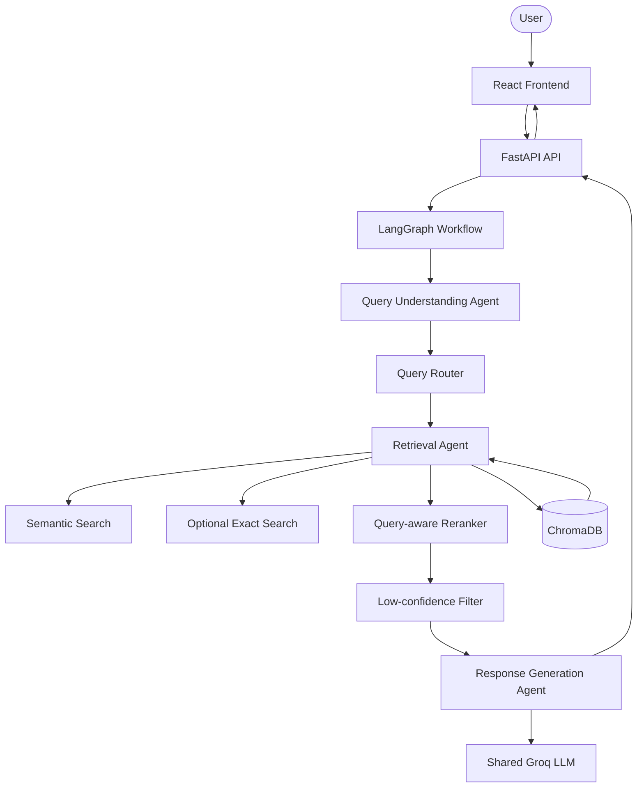
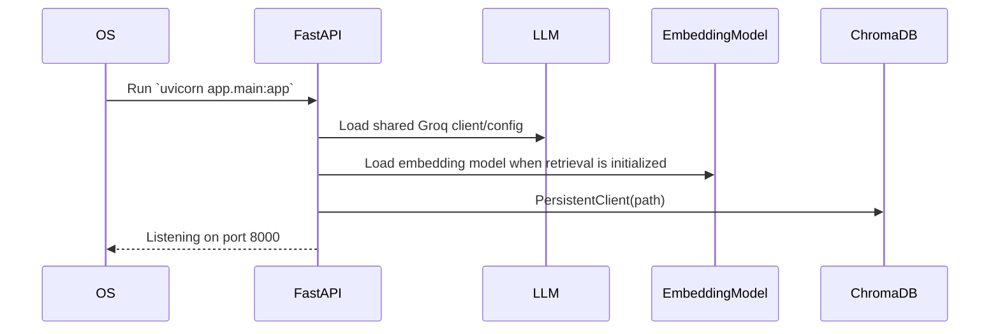
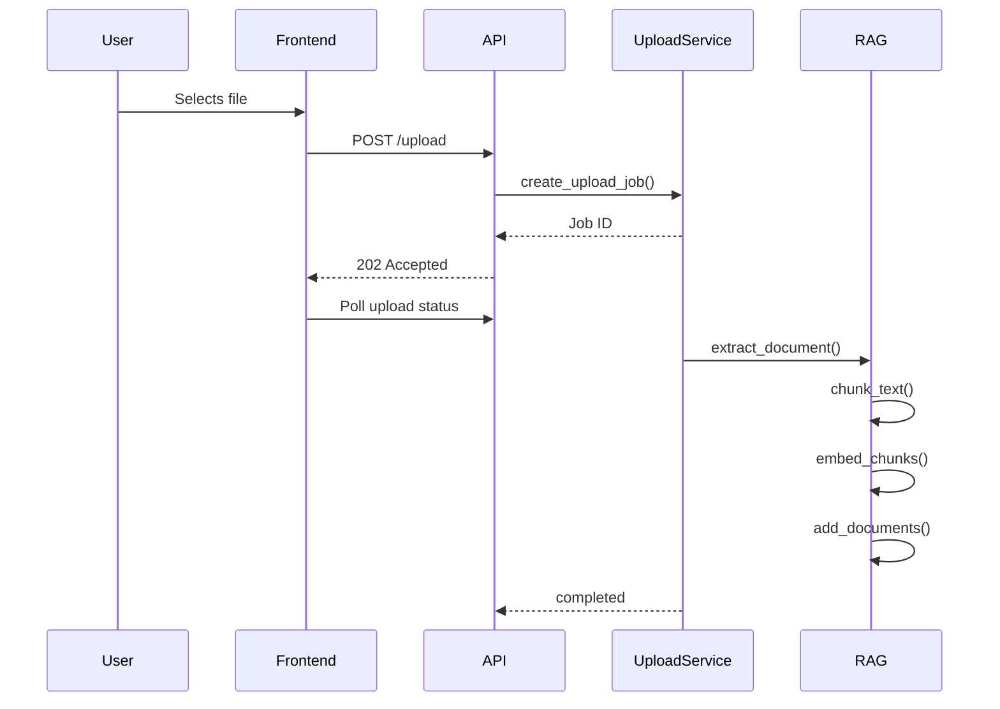
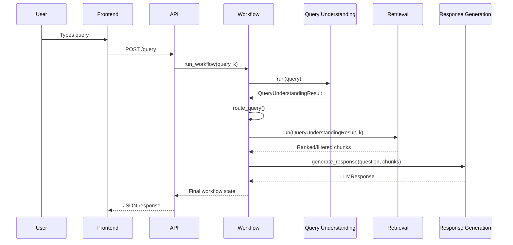
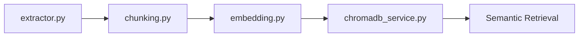
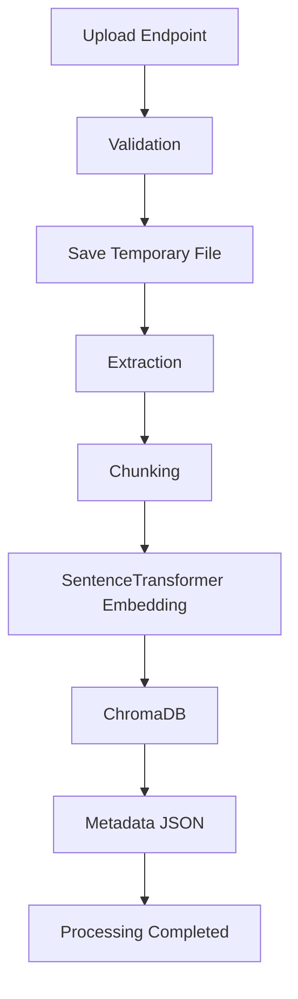
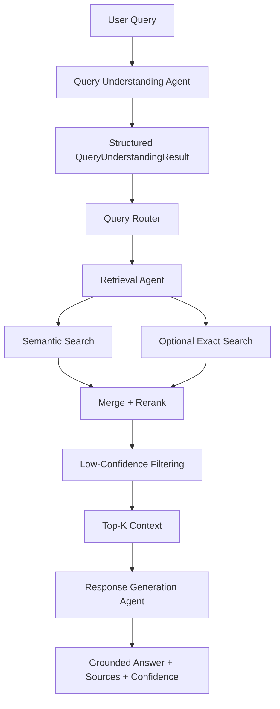

# AI-Based Knowledge Retrieval Platform with Query Resolution System

## SECTION 1 — PROJECT OVERVIEW

### Project Objective
The objective of this project is to provide an AI-powered Knowledge Retrieval Platform that allows users to upload documents (PDF, DOCX, TXT, CSV) and interactively query them using a Retrieval-Augmented Generation (RAG) approach. Milestone 2 extends the Milestone 1 RAG pipeline into a multi-agent query-resolution workflow using Query Understanding, Retrieval, and Response Generation agents coordinated by LangGraph.

### Problem Statement
Organizations and individuals often struggle to quickly extract meaningful and relevant information from large repositories of unstructured documents. Traditional keyword-based search is limited and lacks semantic understanding, making it difficult to answer complex queries based on specific proprietary data.

### Why Retrieval-Augmented Generation (RAG) is used
RAG bridges the gap between the internal knowledge base of a large language model and external proprietary data. By storing document chunks in a vector database and retrieving semantically matching chunks at query time, RAG provides grounded, accurate context for the AI, reducing hallucinations and ensuring responses are derived from uploaded documents.

### Milestone 2 Multi-Agent Resolution
Milestone 2 builds a multi-agent resolution layer on top of the existing RAG infrastructure.

The current workflow is:

```text
User Query
    ↓
Query Understanding Agent
    ↓
Query Router
    ↓
Retrieval Agent
    ↓
Response Generation Agent
    ↓
Grounded Answer + Sources + Confidence
```

### End-to-End Workflow
1. **Upload:** A user uploads a document via the React frontend.
2. **Extraction & Chunking:** The FastAPI backend extracts text and splits it into smaller chunks.
3. **Embedding:** Chunks are converted into semantic vector embeddings using SentenceTransformer.
4. **Storage:** Embeddings and chunks are stored in ChromaDB, while document metadata is persisted in local JSON.
5. **Querying:** The user submits a natural-language query through the chat interface.
6. **Query Understanding:** The Query Understanding Agent normalizes the query, extracts entities/keywords/exact terms, and classifies the query.
7. **Routing:** LangGraph uses deterministic routing based on the structured query-understanding result.
8. **Retrieval:** The Retrieval Agent performs semantic search and optional exact search, merges candidates, reranks them, filters low-confidence candidates, and returns final context.
9. **Response Generation:** The Response Generation Agent creates a grounded answer using only the retrieved context and adds source citations and a confidence indicator.

### Overall System Architecture
The frontend remains a React SPA built with Vite. The backend is a FastAPI application. REST requests enter the API layer and the `/query` endpoint delegates query orchestration to a LangGraph workflow. The agents remain separated by responsibility and the existing Milestone 1 RAG modules continue to provide embeddings, ChromaDB access, extraction and chunking.

---

## SECTION 2 — TECHNOLOGY STACK

### Backend
| Technology | Description |
|---|---|
| Python 3 | Core backend language |
| FastAPI | HTTP API framework |
| Uvicorn | ASGI server |
| Pydantic | Request and response validation |

### Frontend
| Technology | Description |
|---|---|
| React 19 | UI library |
| Vite | Build tool and development server |
| Vanilla CSS | Styling system |

### AI / Agent Frameworks
| Technology | Description |
|---|---|
| LangChain | Text splitting and LLM integration |
| LangGraph | Multi-agent workflow orchestration |
| langchain-groq | LangChain integration for Groq chat models |
| Sentence Transformers | Semantic embedding generation |

### LLM Configuration
| Technology | Description |
|---|---|
| Groq | LLM provider for Query Understanding and Response Generation |
| Configured model | Controlled through `GROQ_MODEL` in `backend/.env` |
| Environment variables | `GROQ_API_KEY` and `GROQ_MODEL` are loaded centrally by `app/core/llm.py` |

### Database
| Technology | Description |
|---|---|
| Local JSON | Lightweight document metadata and processing-state persistence |

### Vector Database
| Technology | Description |
|---|---|
| ChromaDB | Persistent vector storage and semantic retrieval |

### Embedding Model
| Technology | Description |
|---|---|
| all-MiniLM-L6-v2 | Lightweight SentenceTransformer embedding model |

### Document Processing Libraries
| Technology | Description |
|---|---|
| pypdf | PDF extraction |
| python-docx | DOCX extraction |
| pandas | CSV parsing |
| langchain-text-splitters | Recursive text chunking |

### Development Tools
| Technology | Description |
|---|---|
| Oxlint | Frontend linting |
| npm | Frontend package management |

---

## SECTION 3 — COMPLETE PROJECT STRUCTURE

```text
AI-Based Knowledge Retrieval Platform with Query Resolution System/
│
├── backend/                              # FastAPI + Milestone 1/2 backend
│   ├── app/
│   │   ├── __init__.py
│   │   ├── main.py                       # FastAPI application entry point
│   │   │
│   │   ├── api/                          # HTTP/API routers
│   │   │   ├── __init__.py
│   │   │   ├── documents.py              # Document management endpoints
│   │   │   ├── health.py                 # Health check endpoint
│   │   │   ├── query.py                  # Milestone 2 /query endpoint
│   │   │   └── upload.py                 # Upload and status endpoints
│   │   │
│   │   ├── core/                         # Application configuration
│   │   │   ├── __init__.py
│   │   │   ├── config.py                 # Paths and application settings
│   │   │   └── llm.py                    # Centralized Groq LLM setup
│   │   │
│   │   ├── models/                       # API/data models
│   │   │   ├── __init__.py
│   │   │   ├── request_models.py          # Request validation models
│   │   │   └── response_models.py         # Response models
│   │   │
│   │   ├── rag/                          # Milestone 1 RAG infrastructure
│   │   │   ├── __init__.py
│   │   │   ├── chromadb_service.py       # ChromaDB operations
│   │   │   ├── chunking.py               # Text chunking
│   │   │   ├── embedding.py              # Embedding generation
│   │   │   └── extractor.py              # Document text extraction
│   │   │
│   │   ├── services/                     # Backend business services
│   │   │   ├── __init__.py
│   │   │   ├── document_service.py       # Document management logic
│   │   │   ├── metadata_service.py       # Metadata/status persistence
│   │   │   ├── query_service.py           # Milestone 1 baseline retained
│   │   │   └── upload_service.py         # Upload processing pipeline
│   │   │
│   │   ├── agents/                       # Milestone 2 agents
│   │   │   ├── __init__.py
│   │   │   │
│   │   │   ├── query_understanding/      # Query analysis and classification
│   │   │   │   ├── __init__.py
│   │   │   │   ├── agent.py
│   │   │   │   ├── classifier.py
│   │   │   │   ├── normalizer.py
│   │   │   │   ├── extractor.py
│   │   │   │   └── schemas.py
│   │   │   │
│   │   │   ├── retrieval/                # Search, ranking and filtering
│   │   │   │   ├── __init__.py
│   │   │   │   ├── agent.py
│   │   │   │   ├── semantic_search.py
│   │   │   │   ├── exact_search.py
│   │   │   │   └── reranker.py
│   │   │   │
│   │   │   └── response_generation/      # Grounded answer generation
│   │   │       ├── __init__.py
│   │   │       ├── agent.py
│   │   │       ├── prompt_builder.py
│   │   │       ├── llm_call_groq.py
│   │   │       └── schemas.py
│   │   │
│   │   ├── orchestration/                # Milestone 2 workflow orchestration
│   │   │   ├── __init__.py
│   │   │   ├── query_router.py            # Deterministic query routing
│   │   │   └── workflow.py                # LangGraph workflow
│   │   │
│   │   └── utils/                        # Shared utility package
│   │       └── __init__.py
│   │
│   ├── chroma_db/                        # Local ChromaDB data (ignored)
│   ├── metadata/                         # Local metadata/state (ignored)
│   ├── uploads/                          # Local uploaded files (ignored)
│   ├── .env                              # Local secrets/config (ignored)
│   ├── requirements.txt                  # Python dependencies
│   └── test_retrieval_agent.py           # Retrieval integration test
│
├── frontend/                             # React + Vite frontend
│   ├── public/                           # Static public assets
│   ├── src/
│   │   ├── assets/                       # Frontend assets
│   │   ├── components/                   # Reusable UI components
│   │   │   ├── ChatBubble.jsx
│   │   │   ├── FileUploader.jsx
│   │   │   ├── Footer.jsx
│   │   │   └── Sidebar.jsx
│   │   ├── pages/                        # Application pages
│   │   │   ├── ChatPage.jsx              # Chat + Context Inspector
│   │   │   └── UploadPage.jsx             # Document upload UI
│   │   ├── services/                     # Frontend API layer
│   │   │   └── api.js
│   │   ├── App.css
│   │   ├── App.jsx
│   │   ├── index.css
│   │   └── main.jsx
│   ├── .env                              # Local frontend API URL
│   ├── .gitignore
│   ├── package-lock.json
│   ├── package.json
│   └── vite.config.js
│
├── .gitignore
├── PROJECT_GUIDE.md                      # Detailed technical documentation
└── README.md                             # Project overview and setup
```

### Integration Boundary
The repository contains one authoritative backend under `backend/`. The frontend is under `frontend/` and communicates with the backend only through the documented REST API. The old standalone frontend-side backend copy from the frontend team's source package is not part of the final integrated architecture.

### Orchestration Design Decision
The Milestone 2 orchestration layer intentionally contains only:

```text
orchestration/
├── query_router.py
└── workflow.py
```

Separate `state.py` and `nodes.py` files are not required for the current three-agent workflow. `workflow.py` contains the compact LangGraph state definition, node functions, graph construction and public runner. Agent business logic remains inside the agent packages.

---

## SECTION 4 — HIGH LEVEL ARCHITECTURE



---

## SECTION 5 — FRONTEND ARCHITECTURE

The existing React architecture remains valid for Milestone 2. The primary backend-facing change is the shape of the `/query` response: the API now exposes query-understanding information, routing information, retrieval results, and a grounded generated response.

### Folder Structure
- `src/components/`: Reusable UI components.
- `src/pages/`: Page-level screens.
- `src/services/`: API communication.
- `src/assets/`: Static media.

### Current Frontend Responsibilities
- `ChatPage.jsx`: Sends user questions and displays generated answers.
- `ChatBubble.jsx`: Displays user/bot messages and source information.
- `UploadPage.jsx`: Uploads documents and manages document status.
- `FileUploader.jsx`: Handles multipart upload and progress.
- `api.js`: Centralizes REST calls.

### Milestone 2 Integration Note
The integrated frontend communicates only with the FastAPI backend. It does not call Groq, ChromaDB, embeddings, or the agent modules directly.

The frontend should consume the `/query` response fields:

```text
response.answer
response.sources
response.confidence
```

and may additionally use:

```text
query_understanding
route
route_reason
retrieval.results
```

for debugging, transparency, or the developer-facing Context Inspector.

### Frontend-to-Backend Query Flow

```text
Frontend
    ↓
frontend/src/services/api.js
    ↓
POST /query
    ↓
FastAPI
    ↓
LangGraph Workflow
    ↓
Query Understanding
    ↓
Query Router
    ↓
Retrieval Agent
    ↓
Response Generation Agent
    ↓
Final JSON response
    ↓
ChatPage.jsx
    ├── response.answer
    ├── response.sources
    ├── response.confidence
    └── retrieval.results
             ↓
      Context Inspector
```

### Source-to-Context Mapping

`response.sources[*].chunk_id` is matched against `retrieval.results[*].chunk_id` to open the exact retrieved chunk in the Context Inspector. Filename matching is retained only as a fallback when a source does not provide a `chunk_id`.

### Frontend Environment

The frontend uses a separate local environment file:

```text
frontend/.env
```

Example:

```env
VITE_API_BASE_URL=http://127.0.0.1:8000
```

The frontend must never contain `GROQ_API_KEY` or other backend-only secrets.

---

## SECTION 6 — BACKEND ARCHITECTURE

### `app/api/`
The presentation layer. Routers handle HTTP validation and delegate query orchestration to the LangGraph workflow.

- `documents.py`: Document listing and deletion endpoints.
- `health.py`: Health endpoint.
- `query.py`: Delegates `/query` to `run_workflow()`.
- `upload.py`: Upload and upload-status endpoints.

### `app/core/`
- `config.py`: Paths, file limits and application constants.
- `llm.py`: Centralized shared LLM initialization from `backend/.env`.

### `app/services/`
- `document_service.py`: Document listing/deletion business logic.
- `metadata_service.py`: JSON metadata and processing status.
- `query_service.py`: Retained as the Milestone 1 baseline for comparison/backward compatibility; it is not the Milestone 2 orchestration entry point.
- `upload_service.py`: Document ingestion pipeline.

### `app/agents/query_understanding/`
Responsibilities:
- Query normalization.
- Search-query normalization.
- Entity extraction.
- Keyword extraction.
- Exact-term extraction.
- Query classification into factual, procedural, comparative, or ambiguous.
- Structured `QueryUnderstandingResult` output.

### `app/agents/retrieval/`
Responsibilities:
- Semantic candidate generation.
- Optional exact candidate generation.
- Candidate merging/deduplication.
- Query-aware relevance ranking.
- Exact-term/keyword evidence scoring.
- Low-confidence filtering.
- Final Top-K context selection.

The Retrieval Agent itself does not require an LLM.

### `app/agents/response_generation/`
Responsibilities:
- Grounded prompt construction.
- Shared Groq LLM invocation.
- Citation extraction.
- Source metadata preservation.
- Retrieval-aware confidence estimation.
- Validated `LLMResponse` output.

### `app/orchestration/`

#### `query_router.py`
Deterministic routing based on the structured query-understanding result. Current Milestone 2 routes factual, procedural, comparative, and ambiguous queries through the retrieval path because a Clarification Agent is not yet part of the implemented workflow.

#### `workflow.py`
Compact LangGraph orchestration containing:
- shared workflow state
- Query Understanding node
- routing node
- Retrieval node
- Response Generation node
- conditional edges
- graph compilation
- public `run_workflow()` API

---

## SECTION 7 — APPLICATION FLOW

### Application Startup


### Document Upload & Processing
The Milestone 1 ingestion flow remains unchanged:



### Milestone 2 Query Processing


---

## SECTION 8 — REQUEST FLOW

1. **Frontend:** React sends a query through `services/api.js`.
2. **API Layer:** FastAPI validates the request.
3. **Orchestration:** `query.py` calls `run_workflow()`.
4. **Query Understanding:** The workflow produces structured query information.
5. **Routing:** `query_router.py` selects the current resolution path.
6. **Retrieval:** The Retrieval Agent generates and ranks candidates.
7. **Response Generation:** The Response Generation Agent creates a grounded answer with citations.
8. **Response:** The workflow result is converted into the JSON response returned to the frontend.

---

## SECTION 9 — FRONTEND COMPONENT FLOW

The existing component flow remains:

```text
App
├── Sidebar
└── Main Content
    ├── UploadPage
    │   ├── FileUploader
    │   └── Footer
    └── ChatPage
        ├── ChatBubble list
        └── Context Inspector
```

For Milestone 2, `ChatPage` should display at minimum:
- generated answer
- source references
- optional confidence indicator

---

## SECTION 10 — BACKEND ROUTERS

| Router | Method | Route | Input | Output | Backend Handler |
|---|---|---|---|---|---|
| Health | GET | `/` | None | JSON health message | None |
| Documents | GET | `/documents` | None | Document metadata | `get_all_documents` |
| Documents | DELETE | `/documents/{id}` | Path `document_id` | Deletion status | `delete_document_by_id` |
| Query | POST | `/query` | `QueryRequest` | Query-understanding + retrieval + response | `run_workflow` |
| Upload | POST | `/upload` | Multipart file | Accepted status + job ID | Upload service |
| Upload | GET | `/upload/status/{id}` | Path `job_id` | Job state | Upload service |

---

## SECTION 11 — SERVICE / AGENT LAYER

### Milestone 1 baseline
`query_service.py` remains available as the original hybrid retrieval implementation for comparison and backward compatibility.

### Milestone 2 agent layer
The new `/query` execution path does not call `query_service.process_query()` directly. Instead, FastAPI calls the LangGraph workflow, which delegates to the three agent implementations.

This keeps:
- API concerns in `app/api/`
- orchestration concerns in `app/orchestration/`
- agent logic in `app/agents/`
- RAG infrastructure in `app/rag/`

---

## SECTION 12 — RAG PIPELINE

The underlying RAG infrastructure from Milestone 1 is retained:



The Milestone 2 Retrieval Agent uses this existing infrastructure rather than replacing it.

### Retrieval Agent Pipeline
```text
QueryUnderstandingResult
        ↓
search_query
        ↓
Semantic Search
        +
Optional Exact Search
        ↓
Merge / Deduplicate
        ↓
Query-aware Reranking
        ↓
Low-confidence Filtering
        ↓
Diversification
        ↓
Top-K Context
```

---

## SECTION 13 — DATA STORAGE

- `uploads/`: Temporary raw upload storage.
- `metadata/`: `documents.json` and document-processing metadata.
- `chroma_db/`: Persistent ChromaDB vector data.

The Milestone 2 agents do not change the document-ingestion storage model.

---

## SECTION 14 — CONFIGURATION

`app/core/config.py` remains the source of application paths and file-processing constants.

Milestone 2 additionally uses:

```text
backend/.env
```

with:

```env
GROQ_API_KEY=<your-key>
GROQ_MODEL=<configured-model>
```

`app/core/llm.py` loads these variables and creates the shared LangChain `ChatGroq` model instance. Query Understanding and Response Generation reuse the centralized configuration. Retrieval does not require an LLM API key.

**Never commit `.env` or real API keys to Git.**

---

## SECTION 15 — MODELS

### Query Request
`request_models.py` defines the API input model:

```text
query: string
k: integer = 3
```

### Query Understanding Result
The Query Understanding Agent returns:

```text
original_query
normalized_query
search_query
query_type
entities
keywords
exact_terms
```

### Retrieval Result
The Retrieval Agent returns ranked chunks using `chunk_id` as the canonical public identifier for each retrieved chunk.

```text
chunk_id
content
metadata
distance
matched_terms
semantic_score
keyword_score
lexical_score
synergy_score
evidence_score
relevance_score
```

`chunk_id` identifies the specific retrieved chunk. `document_id` remains the identifier for the source document and is preserved inside `metadata`.

The same `chunk_id` is propagated into Response Generation source citations so the frontend can map a citation to the exact retrieved chunk shown in the Context Inspector.

### Response Generation Result
The Response Generation Agent returns:

```text
answer
sources
confidence
```

Each source may preserve:

```text
source
reference
chunk_id
relevance_score
metadata
```

---

## SECTION 16 — API DOCUMENTATION

| Method | Route | Purpose | Request Body | Response |
|---|---|---|---|---|
| GET | `/` | Health Check | None | Health JSON |
| GET | `/documents` | List indexed documents | None | Document list |
| DELETE | `/documents/{id}` | Delete indexed document | None | Deletion JSON |
| POST | `/query` | Run Milestone 2 workflow | `{"query":"...","k":3}` | Query understanding + route + retrieval + response |
| POST | `/upload` | Upload document | Multipart form-data | Accepted job response |
| GET | `/upload/status/{id}` | Check upload status | None | Job status |

### `/query` response
The successful response contains:

```text
success
query
query_understanding
route
route_reason
retrieval
response
```

The `response` object contains the grounded answer, source citations and confidence indicator.

---

## SECTION 17 — DOCUMENT PROCESSING LIFECYCLE



---

## SECTION 18 — MILESTONE 2 QUERY LIFECYCLE



---

## SECTION 19 — VALIDATION / TESTING

### Query Understanding
Validated with factual, procedural, comparative, ambiguous classification scenarios and structured outputs containing query type, keywords and exact terms.

### Retrieval Agent
Validated with:
- identifier/attribute queries such as `What is the email of Name_1?`
- unsupported queries such as a leave-policy question against a dataset containing no leave policy
- generic PDF questions such as `What does the Retrieval Agent do?`

The generic PDF test demonstrated retrieval with:

```text
exact_terms = []
exact_candidates = 0
semantic_candidates > 0
```

and relevant PDF chunks were returned.

### Response Generation
Standalone validation confirmed:
- grounded answer generation
- source citation extraction
- real chunk IDs and metadata
- retrieval-aware confidence

### End-to-End LangGraph
Validated workflow execution:

```text
Query Understanding
    → Router
    → Retrieval
    → Response Generation
```

The workflow produced a final grounded answer with sources and confidence.

### Frontend + Backend Integration

Validated end-to-end through the React frontend:

- Query submission from `ChatPage.jsx`.
- FastAPI `/query` invocation through `frontend/src/services/api.js`.
- LangGraph workflow execution.
- Generated answer displayed from `response.answer`.
- Source citations displayed from `response.sources`.
- Confidence displayed from `response.confidence`.
- Retrieved chunks displayed through `retrieval.results`.
- `chunk_id` preserved between retrieval results and response sources.
- Context Inspector opens the corresponding retrieved chunk.
- Relevance and semantic scores are visible in the inspector.

---

## SECTION 20 — ERROR HANDLING

- Query validation is handled by FastAPI/Pydantic and explicit `k >= 1` checks.
- Query Understanding errors are captured by the workflow state.
- Retrieval errors are captured by the workflow state.
- Response Generation handles empty retrieval context by returning an insufficient-information response with zero confidence.
- The API converts workflow failures into appropriate HTTP errors.
- The system avoids returning unsupported retrieved context when low-confidence filtering removes all candidates.

---

## SECTION 21 — DEVELOPMENT WORKFLOW

### New agent
Create a new package under `app/agents/` with its own implementation and schemas.

### New orchestration behavior
Modify `app/orchestration/query_router.py` or `workflow.py` rather than adding agent logic to FastAPI routers.

### New API endpoint
Add a router under `app/api/` and keep it focused on HTTP concerns.

### New LLM configuration
Update `app/core/llm.py` / `.env` rather than initializing provider credentials inside individual agents.

### New frontend API integration
Add the API wrapper to `frontend/src/services/api.js`.

---

## SECTION 22 — CODING STANDARDS

- FastAPI routers remain thin.
- `workflow.py` contains orchestration, not agent business logic.
- `query_router.py` contains deterministic routing.
- Each agent owns its own domain logic.
- `app/core/llm.py` owns shared LLM initialization.
- Absolute Python imports begin with `app.`.
- Python uses `snake_case`; classes use `PascalCase`.
- `__init__.py` marks Python packages.
- Secrets are stored in `.env` and never committed.

---

## SECTION 23 — SETUP INSTRUCTIONS

### Backend

1. Create the environment:

```bash
python -m venv .venv
```

2. Activate it:

Windows:

```cmd
.venv\Scripts\activate
```

macOS/Linux:

```bash
source .venv/bin/activate
```

3. Install dependencies:

```bash
pip install -r backend/requirements.txt
```

4. Create `backend/.env`:

```env
GROQ_API_KEY=<your-key>
GROQ_MODEL=<configured-model>
```

5. Start FastAPI:

```bash
cd backend
uvicorn app.main:app --reload
```

Backend:

```text
http://localhost:8000
```

Swagger:

```text
http://localhost:8000/docs
```

### Frontend

Create the local frontend environment file:

```text
frontend/.env
```

```env
VITE_API_BASE_URL=http://127.0.0.1:8000
```

Do not place backend secrets such as `GROQ_API_KEY` in the frontend environment.

Install and start the frontend:

```bash
cd frontend
npm install
npm run dev
```

Frontend:

```text
http://localhost:5173
```

---

## SECTION 24 — FUTURE IMPROVEMENTS

The following are future work rather than required for the currently validated Milestone 2 path:

- **Clarification Agent:** Add a dedicated path for ambiguous queries.
- **Conversation Memory:** Maintain multi-turn context across follow-up questions.
- **Advanced Routing:** Route complex queries to specialized resolution paths.
- **Improved Confidence Calibration:** Calibrate response confidence using larger validation sets.
- **Retrieval Optimization:** Evaluate larger candidate pools, learned rerankers and domain-diverse benchmarks.
- **Caching:** Cache frequent queries and retrieval results.
- **Authentication:** Separate knowledge bases by user/account.
- **Dockerization:** Add reproducible containerized deployment.
- **Logging & Monitoring:** Replace ad-hoc prints with structured logging.
- **Automated Testing:** Add pytest/vitest coverage for agents, workflow and API.

---

## SECTION 25 — PROJECT SUMMARY

### Architecture
The platform uses a decoupled React + FastAPI architecture with a LangGraph orchestration layer for Milestone 2.

### Backend
The backend now separates:

```text
HTTP API
    ↓
LangGraph orchestration
    ↓
Agents
    ↓
RAG infrastructure
```

### Milestone 2
The currently validated Milestone 2 flow is:

```text
Query Understanding
    ↓
Query Routing
    ↓
Retrieval
    ↓
Response Generation
```

### Retrieval
The system retains the Milestone 1 semantic/ChromaDB infrastructure while adding query-aware reranking, low-confidence filtering and final context selection.

### Response Generation
The system generates grounded answers from retrieved context and exposes source citations and a confidence indicator.

### Frontend Integration
The validated demo combines the existing Milestone 1 RAG infrastructure, the Milestone 2 multi-agent workflow, and the updated React frontend through the FastAPI REST API. Source citations and retrieval context use a shared `chunk_id` contract for reliable Context Inspector mapping.

### Maintainability
Agent responsibilities, orchestration, API concerns, frontend responsibilities and RAG infrastructure remain separated, allowing each layer to be developed and tested independently.
