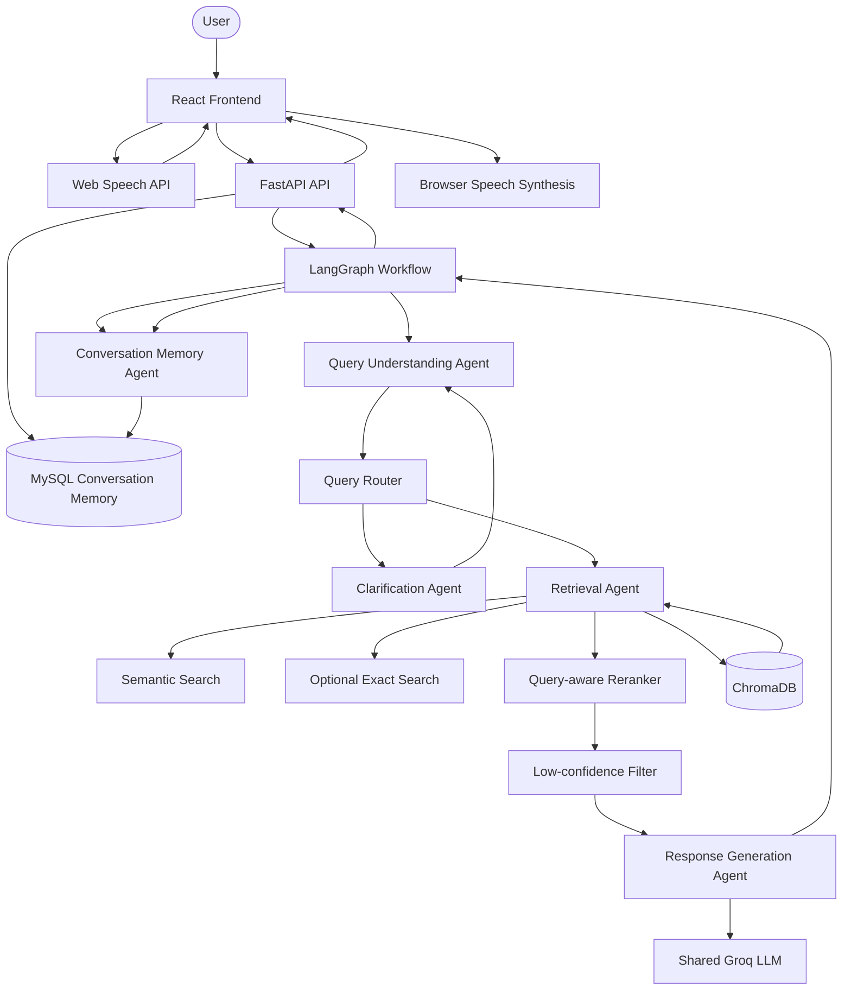
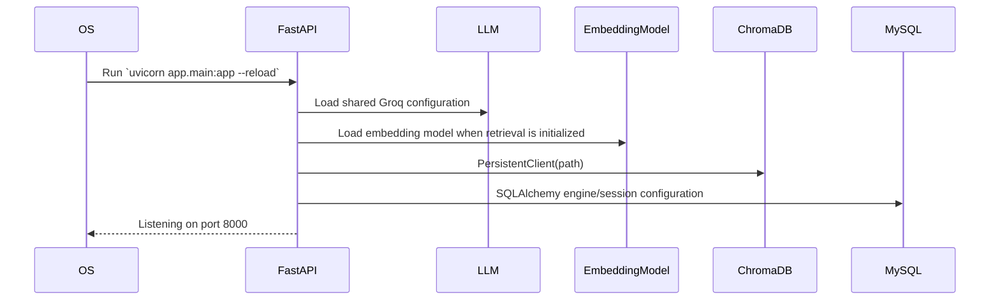
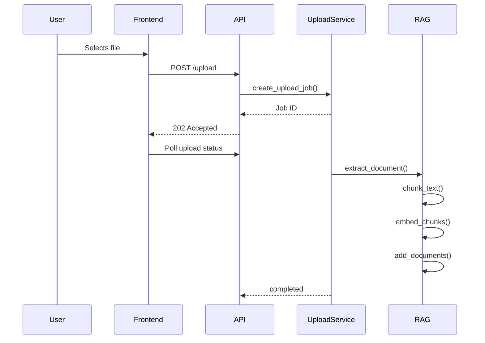
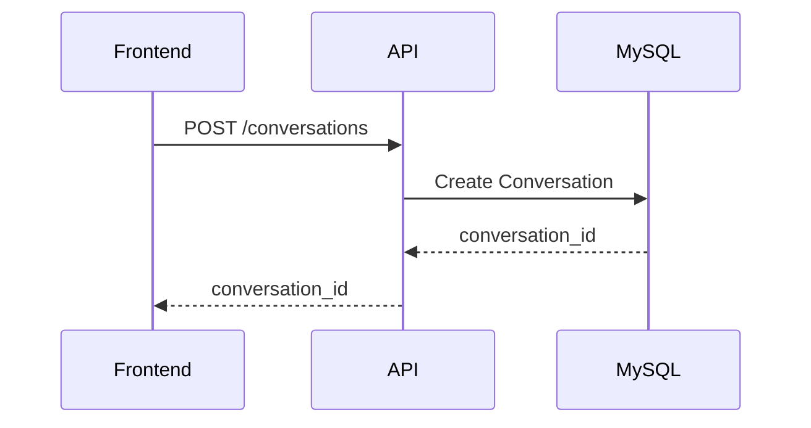
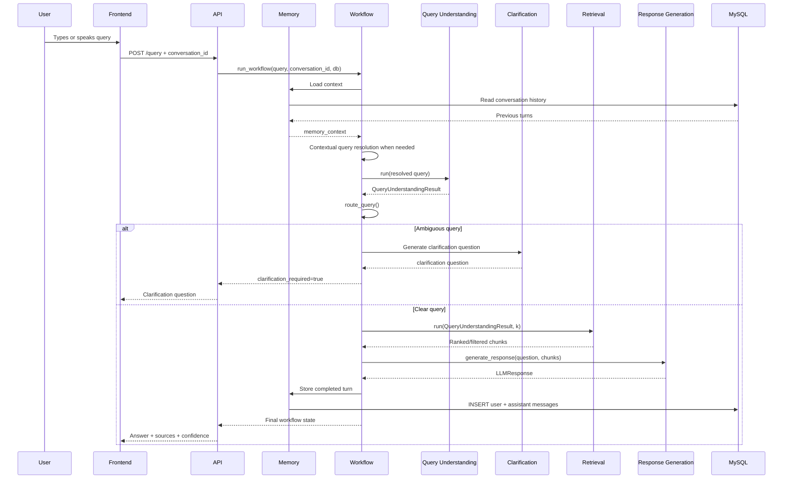
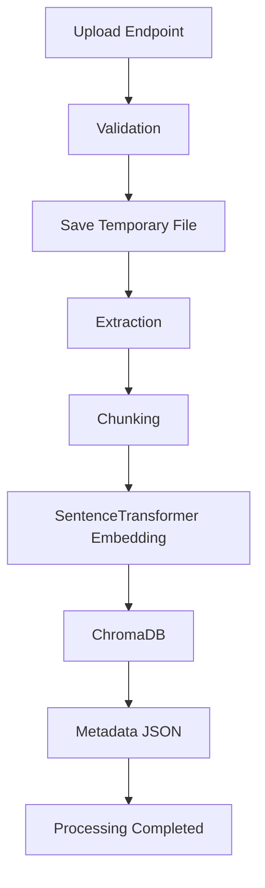
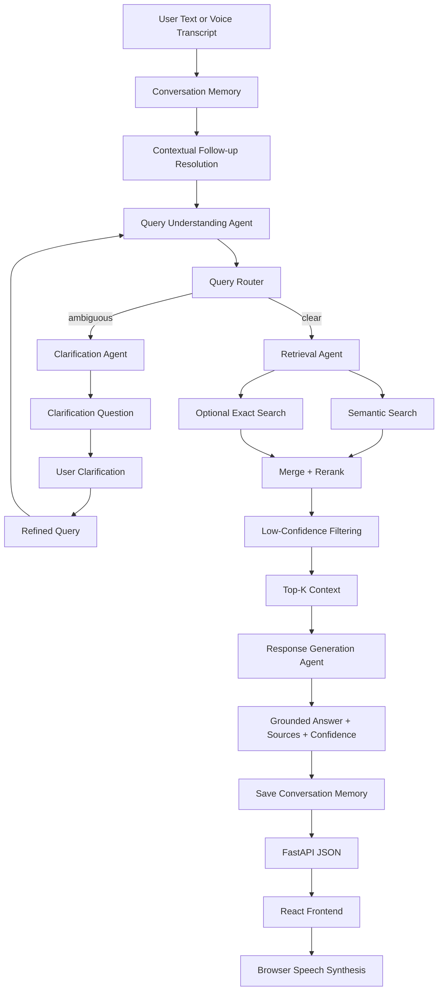

# AI-Based Knowledge Retrieval Platform with Query Resolution System

## SECTION 1 — PROJECT OVERVIEW

### Project Objective
The objective of this project is to provide an AI-powered Knowledge Retrieval Platform that allows users to upload documents (PDF, DOCX, TXT, CSV) and interactively query them using a Retrieval-Augmented Generation (RAG) approach. Milestone 2 extended the Milestone 1 RAG pipeline into a multi-agent query-resolution workflow using Query Understanding, Retrieval, and Response Generation agents coordinated by LangGraph. Milestone 3 extends that workflow with Clarification, Conversation Memory, browser-based Voice Input/Text-to-Speech integration, and Response Transparency in the conversational UI.

### Problem Statement
Organizations and individuals often struggle to quickly extract meaningful and relevant information from large repositories of unstructured documents. Traditional keyword-based search is limited and lacks semantic understanding, making it difficult to answer complex queries based on specific proprietary data.

### Why Retrieval-Augmented Generation (RAG) is used
RAG bridges the gap between the internal knowledge base of a large language model and external proprietary data. By storing document chunks in a vector database and retrieving semantically matching chunks at query time, RAG provides grounded context for the AI, reducing hallucinations and ensuring responses are derived from uploaded documents.

### Milestone 2 Multi-Agent Resolution
Milestone 2 built the multi-agent resolution layer on top of the existing RAG infrastructure.

The validated Milestone 2 path is:

```text
User Query
    ↓
Query Understanding Agent
    ↓
Query Router
    ↓
Retrieval Agent
    ↓
Response Generation Agent
    ↓
Grounded Answer + Sources + Confidence
```

### Milestone 3 Extensions
Milestone 3 adds four integrated capabilities:

1. **Clarification Agent** — handles ambiguous queries by generating targeted clarification questions and refining the query after the user responds.
2. **Conversation Memory Agent** — stores conversation turns in MySQL and loads prior context using a `conversation_id`, allowing contextual follow-up queries such as `What about its ranking?`.
3. **Voice Input and Text-to-Speech** — the browser performs speech recognition through the Web Speech API and uses browser speech synthesis for spoken responses. The recognized transcript follows the same `/query` workflow as typed text.
4. **Response Transparency** — the frontend displays answer citations, source documents, relevance/confidence information, and retrieved context chunks through the chat UI and Context Inspector.

### Milestone 3 Query Workflow
The primary integrated workflow is:

```text
User Text / Voice Transcript
            ↓
     Conversation Memory
            ↓
Context-aware Query Resolution
            ↓
    Query Understanding Agent
            ↓
       Query Router
       ↙          ↘
 Clarification    Retrieval
      ↓              ↓
 refined query   ranked chunks
      ↓              ↓
      └────→ Retrieval
                    ↓
          Response Generation
                    ↓
          Grounded Response
                    ↓
            Save Conversation
                    ↓
              React Frontend
```

For an ambiguous query that needs user clarification, the first request ends after the clarification question is produced. The follow-up request includes the clarification information and continues through query refinement, Query Understanding, Retrieval, Response Generation, and memory persistence.

### End-to-End Workflow
1. **Upload:** A user uploads a document via the React frontend.
2. **Extraction & Chunking:** The FastAPI backend extracts text and splits it into smaller chunks.
3. **Embedding:** Chunks are converted into semantic vector embeddings using SentenceTransformer.
4. **Storage:** Embeddings and chunks are stored in ChromaDB, while document metadata is persisted in local JSON.
5. **Conversation Creation:** The frontend creates a conversation and receives a persistent `conversation_id` from the conversation API.
6. **Querying:** The user submits a natural-language query through the chat interface, either typed or produced by browser speech recognition.
7. **Memory Loading:** The workflow loads previous conversation context when a `conversation_id` is supplied.
8. **Contextual Resolution:** Context-dependent follow-ups can be rewritten into standalone queries before the existing Query Understanding Agent processes them.
9. **Query Understanding:** The Query Understanding Agent normalizes the query, extracts entities/keywords/exact terms, and classifies it.
10. **Routing:** LangGraph uses deterministic routing based on the structured query-understanding result.
11. **Clarification:** Ambiguous queries are routed to the Clarification Agent, which generates a targeted question or refines the query after receiving the user's clarification.
12. **Retrieval:** The Retrieval Agent performs semantic search and optional exact search, merges candidates, reranks them, filters low-confidence candidates, and returns final context.
13. **Response Generation:** The Response Generation Agent creates a grounded answer using retrieved context and adds source citations and a confidence indicator.
14. **Conversation Persistence:** Completed user/assistant turns are stored in the MySQL-backed conversation memory layer.
15. **Transparency:** The frontend displays the answer, citations, source references, relevance/confidence, and exact retrieved chunks.
16. **Voice Output:** The browser can read the returned answer aloud using Speech Synthesis; citation markers are not required in the spoken version.

### Overall System Architecture
The frontend remains a React SPA built with Vite. The backend is a FastAPI application. REST requests enter the API layer, and the `/query` endpoint delegates query orchestration to a LangGraph workflow. The agents remain separated by responsibility. Milestone 1 RAG modules continue to provide embeddings, ChromaDB access, extraction and chunking. Milestone 3 adds a MySQL-backed conversation layer and browser-native voice capabilities.

---

## SECTION 2 — TECHNOLOGY STACK

### Backend
| Technology | Description |
|---|---|
| Python 3 | Core backend language |
| FastAPI | HTTP API framework |
| Uvicorn | ASGI server |
| Pydantic | Request and response validation |
| SQLAlchemy | ORM/database session management for conversation memory |
| PyMySQL | MySQL database driver |

### Frontend
| Technology | Description |
|---|---|
| React 19 | UI library |
| Vite | Build tool and development server |
| JavaScript | Frontend language |
| Vanilla CSS | Styling system |
| Web Speech API | Browser speech-to-text |
| Speech Synthesis API | Browser text-to-speech |

### AI / Agent Frameworks
| Technology | Description |
|---|---|
| LangChain | LLM integration and related utilities |
| LangGraph | Multi-agent workflow orchestration |
| langchain-groq | LangChain integration for Groq chat models |
| Sentence Transformers | Semantic embedding generation |

### LLM Configuration
| Technology | Description |
|---|---|
| Groq | LLM provider for Query Understanding, Clarification, contextual query resolution, and Response Generation |
| Configured model | Controlled through `GROQ_MODEL` in `backend/.env` |
| Environment variables | `GROQ_API_KEY` and `GROQ_MODEL` are loaded centrally by `app/core/llm.py` |

### Database
| Technology | Description |
|---|---|
| MySQL | Persistent conversation and message storage for Milestone 3 memory |
| SQLAlchemy | Database ORM/session layer |
| PyMySQL | MySQL connectivity |
| Local JSON | Lightweight document metadata and processing-state persistence |

### Vector Database
| Technology | Description |
|---|---|
| ChromaDB | Persistent vector storage and semantic retrieval |

### Embedding Model
| Technology | Description |
|---|---|
| all-MiniLM-L6-v2 | Lightweight SentenceTransformer embedding model |

### Document Processing Libraries
| Technology | Description |
|---|---|
| pypdf | PDF extraction |
| python-docx | DOCX extraction |
| pandas | CSV parsing |
| langchain-text-splitters | Recursive text chunking |

### Development Tools
| Technology | Description |
|---|---|
| Oxlint | Frontend linting |
| npm | Frontend package management |
| XAMPP | Local MySQL development environment |

---

## SECTION 3 — COMPLETE PROJECT STRUCTURE

```text
AI-Based Knowledge Retrieval Platform with Query Resolution System/
│
├── backend/
│   ├── app/
│   │   ├── __init__.py
│   │   ├── main.py                              # FastAPI application entry point
│   │   │
│   │   ├── api/                                 # HTTP/API routers
│   │   │   ├── __init__.py
│   │   │   ├── documents.py                     # Document management endpoints
│   │   │   ├── health.py                        # Health check endpoint
│   │   │   ├── query.py                         # Main M2/M3 /query endpoint
│   │   │   ├── conversations.py                 # Conversation management endpoints
│   │   │   └── upload.py                        # Upload and status endpoints
│   │   │
│   │   ├── core/                                # Application configuration and database setup
│   │   │   ├── __init__.py
│   │   │   ├── config.py                        # Paths and application settings
│   │   │   ├── llm.py                           # Centralized Groq LLM setup
│   │   │   └── database.py                      # SQLAlchemy engine/session/Base
│   │   │
│   │   ├── models/                              # API/database models
│   │   │   ├── __init__.py
│   │   │   ├── request_models.py                # Query + M3 request validation
│   │   │   ├── response_models.py               # API response models
│   │   │   └── conversation.py                  # Conversation database ORM model, if separated
│   │   │
│   │   ├── rag/                                 # Milestone 1 RAG infrastructure
│   │   │   ├── __init__.py
│   │   │   ├── chromadb_service.py              # ChromaDB operations
│   │   │   ├── chunking.py                      # Text chunking
│   │   │   ├── embedding.py                     # Embedding generation
│   │   │   └── extractor.py                     # Document text extraction
│   │   │
│   │   ├── services/                            # Backend business services
│   │   │   ├── __init__.py
│   │   │   ├── document_service.py              # Document management logic
│   │   │   ├── metadata_service.py              # JSON metadata/status persistence
│   │   │   ├── query_service.py                 # Milestone 1 baseline retained
│   │   │   └── upload_service.py                # Upload processing pipeline
│   │   │
│   │   ├── agents/                              # AI agents
│   │   │   ├── __init__.py
│   │   │   ├── query_understanding/             # Query analysis and classification
│   │   │   │   ├── __init__.py
│   │   │   │   ├── agent.py
│   │   │   │   ├── classifier.py
│   │   │   │   ├── normalizer.py
│   │   │   │   ├── extractor.py
│   │   │   │   └── schemas.py
│   │   │   │
│   │   │   ├── retrieval/                       # Search, ranking and filtering
│   │   │   │   ├── __init__.py
│   │   │   │   ├── agent.py
│   │   │   │   ├── semantic_search.py
│   │   │   │   ├── exact_search.py
│   │   │   │   └── reranker.py
│   │   │   │
│   │   │   ├── response_generation/             # Grounded answer generation
│   │   │   │   ├── __init__.py
│   │   │   │   ├── agent.py
│   │   │   │   ├── prompt_builder.py
│   │   │   │   ├── llm_call_groq.py
│   │   │   │   └── schemas.py
│   │   │   │
│   │   │   ├── clarification/                   # Milestone 3 ambiguity handling
│   │   │   │   ├── __init__.py
│   │   │   │   ├── agent.py
│   │   │   │   └── schemas.py
│   │   │   │
│   │   │   └── memory/                          # Milestone 3 conversation memory
│   │   │       ├── __init__.py
│   │   │       ├── agent.py
│   │   │       └── storage.py
│   │   │
│   │   ├── voice/                               # Milestone 3 voice backend contract
│   │   │   ├── __init__.py
│   │   │   ├── input.py                         # Transcript validation/preparation
│   │   │   ├── output.py                        # Speech-ready response preparation
│   │   │   ├── schemas.py                       # Voice request/response schemas
│   │   │   └── service.py                       # Voice module coordinator
│   │   │
│   │   ├── transparency/                        # Milestone 3 response transparency
│   │   │   ├── __init__.py
│   │   │   ├── schemas.py                       # Transparency response schemas
│   │   │   └── service.py                       # Transparency/evidence builder
│   │   │
│   │   ├── test/                                 # Application-level tests
│   │   │   └── test_memory.py                    # Conversation memory integration test
│   │   │
│   │   ├── orchestration/                       # LangGraph orchestration
│   │   │   ├── __init__.py
│   │   │   ├── state.py                         # Shared workflow state
│   │   │   ├── nodes.py                         # Workflow node implementations
│   │   │   ├── query_router.py                  # Deterministic route selection
│   │   │   └── workflow.py                      # LangGraph graph construction/runner
│   │   │
│   │   └── utils/
│   │       └── __init__.py
│   │
│   ├── chroma_db/                               # Local ChromaDB data (ignored)
│   ├── metadata/                                # Local metadata/state (ignored)
│   ├── uploads/                                 # Local uploaded files (ignored)
│   ├── .env                                     # Local secrets/config (ignored)
│   ├── .env.example                             # Environment variable template
│   ├── requirements.txt                         # Python dependencies
│   └── create_memory_tables.py                  # Create conversation tables
│
├── frontend/
│   ├── public/                                  # Static public assets
│   ├── src/
│   │   ├── assets/                              # Frontend assets
│   │   ├── components/                          # Reusable UI components
│   │   │   ├── ChatBubble.jsx
│   │   │   ├── CitationDisplay.jsx              # If included in integrated UI
│   │   │   ├── FileUploader.jsx
│   │   │   ├── Footer.jsx
│   │   │   ├── GroundingEvidenceView.jsx        # If included in integrated UI
│   │   │   ├── Sidebar.jsx
│   │   │   ├── VoiceInput.jsx                   # Voice UI component, if used
│   │   │   └── speechtotext.jsx                 # Speech helper, if retained
│   │   ├── hooks/
│   │   │   └── useSpeechRecognition.js          # Web Speech API hook
│   │   ├── pages/
│   │   │   ├── ChatPage.jsx                     # Chat + voice + transparency UI
│   │   │   └── UploadPage.jsx                    # Document upload UI
│   │   ├── services/
│   │   │   └── api.js                           # REST API communication
│   │   ├── App.css
│   │   ├── App.jsx
│   │   ├── index.css
│   │   └── main.jsx
│   ├── .env                                     # Local frontend API URL (ignored)
│   ├── .env.example                             # Frontend environment template
│   ├── .gitignore
│   ├── package-lock.json
│   ├── package.json
│   └── vite.config.js
│
├── .gitignore
├── PROJECT_GUIDE.md
└── README.md
```

### Integration Boundary
The repository contains one authoritative backend under `backend/`. The frontend is under `frontend/` and communicates with the backend through the REST API. The old standalone frontend-side backend copy from the frontend team's source package is not part of the integrated architecture.

### Orchestration Design Decision
Milestone 3 intentionally separates shared workflow state and node logic from the graph definition:

```text
orchestration/
├── state.py
├── nodes.py
├── query_router.py
└── workflow.py
```

`workflow.py` is responsible primarily for graph construction, conditional transitions, compilation, and the public runner. `nodes.py` coordinates agent calls and state updates. Agent business logic remains inside the respective agent packages.

---

## SECTION 4 — HIGH LEVEL ARCHITECTURE



---

## SECTION 5 — FRONTEND ARCHITECTURE

The React frontend remains responsible for presentation and browser capabilities. Milestone 3 adds microphone interaction, conversation state, clarification display, and response transparency without moving RAG/agent logic into the browser.

### Folder Structure
- `src/components/`: Reusable UI components.
- `src/hooks/`: React hooks such as `useSpeechRecognition.js`.
- `src/pages/`: Page-level screens.
- `src/services/`: REST API communication.
- `src/assets/`: Static media.

### Current Frontend Responsibilities
- `ChatPage.jsx`: Sends user questions, maintains the current conversation ID, handles voice transcription, displays responses, clarification questions, citations, confidence and retrieved context.
- `useSpeechRecognition.js`: Uses browser Web Speech API for speech-to-text and returns transcript/listening/error state to `ChatPage`.
- `ChatBubble.jsx`: Displays user/bot messages and source information.
- `UploadPage.jsx`: Uploads documents and manages document status.
- `FileUploader.jsx`: Handles multipart upload and progress.
- `api.js`: Centralizes document, query, and conversation REST calls.

### Voice Input Responsibilities
The frontend microphone flow is browser-based:

```text
Microphone
    ↓
Web Speech API
    ↓
Transcript
    ↓
ChatPage
    ↓
api.sendChatMessage()
    ↓
POST /query
```

The provided `useSpeechRecognition.js` hook checks for `window.SpeechRecognition` / `window.webkitSpeechRecognition`, handles listening state, interim results, language configuration, microphone errors and cleanup. The transcript is delivered through the hook's `onResult` callback.

### Text-to-Speech Responsibilities
Speech synthesis is performed in the browser. Backend voice helpers only prepare clean speech-ready text where applicable; they do not access the microphone or synthesize audio. Citation markers such as `[1]` can be removed from the speech version while the display answer retains citations.

### Conversation State
`ChatPage.jsx` creates/retains a backend `conversation_id` and passes it to `api.sendChatMessage()` for subsequent messages in the same chat. Clearing the conversation starts a new backend conversation.

### Clarification UI
When `/query` returns:

```text
clarification_required = true
clarification_question = "..."
```

the frontend displays the clarification question instead of attempting to read `response.answer` from a null response object.

### Milestone 3 Integration Note
The integrated frontend communicates only with the FastAPI backend. It does not call Groq, ChromaDB, embeddings, SQLAlchemy, or agent modules directly.

### Frontend-to-Backend Query Flow

```text
ChatPage.jsx
    ↓
frontend/src/services/api.js
    ↓
POST /query
    ↓
FastAPI query.py
    ↓
LangGraph workflow
    ↓
Memory → Query Understanding → Router
                             ↙       ↘
                      Clarification  Retrieval
                             ↓          ↓
                         refinement → Response Generation
                                         ↓
                                  Save Conversation
                                         ↓
                                    JSON response
                                         ↓
                                      ChatPage
```

### Source-to-Context Mapping
`response.sources[*].chunk_id` is matched against `retrieval.results[*].chunk_id` to open the exact retrieved chunk in the Context Inspector. Filename matching remains a fallback when a source does not provide a `chunk_id`.

### Response Transparency
The current conversational UI provides response transparency through:

- Source references associated with the generated answer.
- Per-source relevance information.
- Overall response confidence.
- Retrieved chunk content.
- Chunk ID and metadata in the Context Inspector.
- Semantic score information for inspected chunks.

This is the implemented response-transparency behavior; it is not a separate LLM or retrieval stage.

### Frontend Environment
The frontend uses:

```text
frontend/.env
```

Example:

```env
VITE_API_BASE_URL=http://127.0.0.1:8000
```

The frontend must never contain `GROQ_API_KEY`, MySQL credentials, or other backend-only secrets.

---

## SECTION 6 — BACKEND ARCHITECTURE

### `app/api/`
The presentation layer. Routers validate HTTP requests and delegate work to services/workflow components.

- `documents.py`: Document listing and deletion endpoints.
- `health.py`: Health endpoint.
- `query.py`: Delegates `/query` to `run_workflow()` and supplies the database session for memory-enabled requests.
- `conversations.py`: Creates, lists, reads and deletes persistent conversations and their messages/context.
- `upload.py`: Upload and upload-status endpoints.

### `app/core/`
- `config.py`: Paths, file limits and application constants.
- `llm.py`: Centralized shared LLM initialization from `backend/.env`.
- `database.py`: SQLAlchemy engine, declarative base and database session dependency.

### `app/services/`
- `document_service.py`: Document listing/deletion business logic.
- `metadata_service.py`: JSON metadata and processing status.
- ``query_service.py`: Retained as the Milestone 1 baseline for comparison/backward compatibility; it is not the main Milestone 3 orchestration entry point.
- `upload_service.py`: Document ingestion pipeline.

### `app/agents/query_understanding/`
Responsibilities:
- Query normalization.
- Search-query normalization.
- Entity extraction.
- Keyword extraction.
- Exact-term extraction.
- Query classification into factual, procedural, comparative, or ambiguous.
- Structured `QueryUnderstandingResult` output.

### `app/agents/retrieval/`
Responsibilities:
- Semantic candidate generation.
- Optional exact candidate generation.
- Candidate merging/deduplication.
- Query-aware relevance ranking.
- Exact-term/keyword evidence scoring.
- Low-confidence filtering.
- Final Top-K context selection.

The Retrieval Agent does not require an LLM API call.

### `app/agents/response_generation/`
Responsibilities:
- Grounded prompt construction.
- Shared Groq LLM invocation.
- Citation extraction.
- Source metadata preservation.
- Retrieval-aware confidence estimation.
- Validated `LLMResponse` output.

### `app/agents/clarification/`
Responsibilities:
- Detect/process clarification-required cases as directed by orchestration.
- Generate focused clarification questions.
- Accept the user's clarification response.
- Produce a refined query suitable for the existing Query Understanding/Retrieval pipeline.

The Clarification Agent owns clarification logic; orchestration only decides when to invoke it and how its result changes workflow state.

### `app/agents/memory/`
Responsibilities:
- Load conversation context using `conversation_id`.
- Store completed user/assistant turns.
- Provide context to contextual follow-up resolution.
- Isolate conversation persistence from the rest of the agent layer.

The memory layer uses SQLAlchemy sessions backed by MySQL. `conversation_id` is the persistent identifier for a conversation.

### `app/voice/`
The Voice folder is a module, not an AI agent. It therefore belongs directly under `app/`, not `app/agents/`.

Responsibilities:
- Validate transcript data received from the browser.
- Prepare transcript text for the existing query workflow.
- Build speech-ready response data.
- Provide voice request/response schemas.

The current integrated frontend uses the transcript as an ordinary `/query` request rather than requiring a separate audio-processing backend. The backend does not perform microphone capture or speech recognition.

### `app/transparency/`
The Response Transparency module is a backend service layer, not an AI agent and not a separate retrieval pipeline. It converts the existing retrieval output into a presentation-ready evidence object.

- `schemas.py`: Defines `SourceChunk` and `TransparencyResponse` models containing source document, optional page, chunk ID, content, relevance score, citation, overall confidence, and confidence level.
- `service.py`: Extracts chunks and metadata from the existing retrieval result, normalizes common content/metadata shapes, generates human-readable citations, calculates transparency confidence from available relevance scores, and assigns `High`, `Medium`, or `Low` confidence levels.
- `__init__.py`: Exposes `build_transparency()` for the API layer.

The service is invoked after the existing M3 workflow completes. `query.py` adds the resulting `transparency` object to the `/query` response while preserving the existing `response` and `retrieval` fields. The transparency service does not replace Response Generation's existing confidence value and does not change retrieval ranking/filtering.

The integrated transparency flow is:

```text
Retrieval Result
      ↓
transparency.service.build_transparency()
      ↓
TransparencyResponse
      ├── sources
      │    ├── document
      │    ├── page
      │    ├── chunk_id
      │    ├── content
      │    ├── relevance_score
      │    └── citation
      ├── confidence
      └── confidence_level
      ↓
query.py
      ↓
`transparency` in `/query` response
      ↓
React Context Inspector / transparency UI
```

There is no mandatory standalone `/transparency` API route in the current integrated architecture. Keeping transparency behind `/query` avoids an unnecessary second client request and keeps the endpoint contract aligned with the existing RAG workflow.

### `app/orchestration/`

#### `state.py`
Defines the shared LangGraph `WorkflowState`, including:
- `query`
- `k`
- `query_analysis`
- `route`
- `route_reason`
- `retrieval_result`
- `response`
- `error`
- `conversation_id`
- `memory_context`
- `clarification_required`
- `clarification_question`
- `clarification_answer`
- `original_query`
- `refined_query`
- internal database session (`_db`)

#### `nodes.py`
Contains orchestration-only node functions:
- `memory_node()`
- `query_understanding_node()`
- `routing_node()`
- contextual follow-up query resolution
- `clarification_node()`
- `retrieval_node()`
- `response_generation_node()`
- `save_memory_node()`

#### `query_router.py`
Contains deterministic route selection:

```text
factual       → retrieval
procedural    → retrieval
comparative   → retrieval
ambiguous     → clarification
```

Unexpected query types have a safe retrieval fallback.

#### `workflow.py`
Builds and compiles the LangGraph workflow and exposes `run_workflow()` with support for:
- `query`
- `k`
- `conversation_id`
- `clarification_answer`
- `clarification_question`
- `original_query`
- SQLAlchemy `db` session

The workflow preserves the existing Milestone 2 retrieval and response-generation path and adds memory/clarification branches around it.

---

## SECTION 7 — APPLICATION FLOW

### Application Startup


### Document Upload & Processing
The Milestone 1 ingestion flow remains unchanged:



### Milestone 3 New Conversation


### Milestone 3 Query Processing


### Contextual Follow-up Resolution
A context-dependent query can be resolved before normal Query Understanding:

```text
Previous conversation:
User: What does the Retrieval Agent do?
Assistant: The Retrieval Agent performs semantic search...

Current query:
What about its ranking?

Contextual resolution:
What is the ranking process used by the Retrieval Agent?

↓
Existing Query Understanding Agent
↓
Retrieval
↓
Response Generation
```

This preserves the existing Query Understanding Agent interface, which expects a query string.

---

## SECTION 8 — REQUEST FLOW

### Standard typed query
1. Frontend sends a `QueryRequest` through `services/api.js`.
2. FastAPI validates the request.
3. `query.py` calls `run_workflow()` with the query, optional `conversation_id`, clarification fields, and database session.
4. Memory context is loaded when a conversation ID exists.
5. Query Understanding produces structured query information.
6. `query_router.py` selects retrieval or clarification.
7. Retrieval returns ranked context.
8. Response Generation produces the grounded answer, citations and confidence.
9. The completed turn is persisted when `conversation_id` exists.
10. `query.py` builds the Response Transparency object from the existing retrieval result.
11. FastAPI returns the final JSON response.

### Voice query
1. Browser microphone captures speech.
2. Web Speech API produces a transcript.
3. `ChatPage.jsx` places the transcript into the normal query input.
4. `api.sendChatMessage()` sends the transcript through `POST /query` with the current conversation ID.
5. The backend follows the same M3 workflow as a typed query.
6. The answer is displayed in the chat.
7. Browser Speech Synthesis can read the answer aloud.

### Clarification query
1. An ambiguous query is submitted.
2. Router selects `clarification`.
3. Clarification Agent generates a question.
4. Frontend displays `clarification_question`.
5. User responds.
6. Frontend resubmits the response with the same conversation ID and clarification information where required.
7. Clarification Agent refines the original query.
8. Refined query returns to Query Understanding → Router → Retrieval → Response Generation.
9. Final turn is saved to memory.

---

## SECTION 9 — FRONTEND COMPONENT FLOW

```text
App
├── Sidebar
└── Main Content
    ├── UploadPage
    │   ├── FileUploader
    │   └── Footer
    └── ChatPage
        ├── ChatBubble list
        ├── Voice / microphone interaction
        ├── Clarification display
        └── Context Inspector
            ├── source document
            ├── chunk ID
            ├── relevance
            ├── semantic score
            └── retrieved chunk content
```

### ChatPage Responsibilities
`ChatPage.jsx` maintains:
- current messages
- current input
- listening state through `useSpeechRecognition.js`
- `conversationId`
- retrieved results
- selected source
- loading state
- speech errors

The page sends the conversation ID through `api.sendChatMessage()` and handles both normal answers and clarification responses.

---

## SECTION 10 — BACKEND ROUTERS

| Router | Method | Route | Input | Purpose |
|---|---|---|---|---|
| Health | GET | `/` | None | Health check |
| Documents | GET | `/documents` | None | List indexed documents |
| Documents | DELETE | `/documents/{id}` | Path `document_id` | Delete indexed document |
| Query | POST | `/query` | `QueryRequest` | Run M2/M3 workflow |
| Conversations | POST | `/conversations` | Conversation creation data | Create a conversation and return `conversation_id` |
| Conversations | GET | `/conversations` | None | List saved conversations |
| Conversations | GET | `/conversations/{id}` | Path `conversation_id` | Get one conversation and messages |
| Conversations | GET | `/conversations/{id}/context` | Path `conversation_id` | Get memory context |
| Conversations | DELETE | `/conversations/{id}` | Path `conversation_id` | Delete a conversation |
| Upload | POST | `/upload` | Multipart file | Upload document |
| Upload | GET | `/upload/status/{id}` | Path `job_id` | Check upload status |

The current integrated voice frontend uses `POST /query`; a separate audio-processing endpoint is not required because voice recognition occurs in the browser.

---

## SECTION 11 — SERVICE / AGENT LAYER

### Milestone 1 baseline
`query_service.py` remains available as the original retrieval implementation for comparison and backward compatibility.

### Milestone 2 agent layer
The main query execution path uses the LangGraph workflow rather than calling `query_service.process_query()` directly.

### Milestone 3 additions
The main execution path now adds:

```text
Memory Agent
    ↓
Contextual query resolution
    ↓
Query Understanding
    ↓
Router
    ├── Clarification Agent
    └── Retrieval Agent
              ↓
       Response Generation
              ↓
         Memory Agent
```

This keeps:
- API concerns in `app/api/`
- orchestration concerns in `app/orchestration/`
- agent logic in `app/agents/`
- voice contract logic in `app/voice/`
- database setup in `app/core/database.py`
- RAG infrastructure in `app/rag/`

---

## SECTION 12 — RAG PIPELINE

The underlying RAG infrastructure from Milestone 1 is retained:


### Retrieval Agent Pipeline

```text
QueryUnderstandingResult
        ↓
search_query
        ↓
Semantic Search
        +
Optional Exact Search
        ↓
Merge / Deduplicate
        ↓
Query-aware Reranking
        ↓
Low-confidence Filtering
        ↓
Diversification
        ↓
Top-K Context
```

Milestone 3 does not replace this retrieval pipeline. Clarification and conversation memory feed into the existing pipeline rather than creating a separate RAG implementation.

---

## SECTION 13 — CONVERSATION MEMORY

### Purpose
Conversation Memory allows each user's conversation to be identified by a persistent `conversation_id` and stores user/assistant turns in MySQL.

### Database Flow

```text
Frontend
   ↓
POST /conversations
   ↓
conversation_id
   ↓
POST /query
   ↓
Memory Agent
   ├── get_context()
   └── store_turn()
   ↓
MySQL
```

### Conversation Context
A follow-up query can use previous turns to resolve references such as:
- `it`
- `its`
- `this`
- `that`
- `they`
- `them`
- `the above`
- `the previous answer`

Example:

```text
User: What does the Retrieval Agent do?
Assistant: The Retrieval Agent performs semantic search...

User: What about its ranking?
```

The contextual query-resolution step can turn the follow-up into a standalone query before Query Understanding.

### MySQL Requirements
MySQL must be running before using conversation endpoints or memory-enabled queries. XAMPP can be used to run MySQL locally.

Create the conversation tables with:

```bash
cd backend
python create_memory_tables.py
```

### Backward Compatibility
A query without `conversation_id` remains usable as an M2-compatible single-query request. A query with `conversation_id` enables memory features.

---

## SECTION 14 — CLARIFICATION

### Clarification Routing
The Milestone 3 deterministic router uses:

```text
factual       → retrieval
procedural    → retrieval
comparative   → retrieval
ambiguous     → clarification
```

### Clarification First Pass

```text
User query
   ↓
Query Understanding
   ↓
query_type = ambiguous
   ↓
Query Router
   ↓
Clarification Agent
   ↓
clarification_question
   ↓
Frontend
```

The workflow terminates that request after producing the clarification question because the user must provide the missing information.

### Clarification Follow-up
The follow-up request carries the relevant clarification information. The Clarification Agent refines the original query, and the workflow sends the refined query back through Query Understanding and the normal retrieval/response path.

### Important Separation
The Clarification Agent owns the question/refinement logic. `query_router.py` only decides whether the query enters retrieval or clarification. `workflow.py`/`nodes.py` only orchestrate the transition.

---

## SECTION 15 — VOICE MODULE

### Architecture
The Voice module is **not an AI agent**. It is a backend contract/helper module directly under `app/voice/`.

The browser performs the actual speech work:

```text
Microphone
    ↓
Browser Web Speech API
    ↓
Transcript
    ↓
Normal POST /query
    ↓
M3 workflow
    ↓
Answer
    ↓
Browser Speech Synthesis API
```

### Backend Voice Responsibilities
- Validate the transcript.
- Normalize/prep the transcript before the normal query pipeline.
- Preserve `conversation_id` when a voice query participates in a conversation.
- Prepare a speech-friendly version of the answer by removing citation markers where needed.

### Frontend Hook
`frontend/src/hooks/useSpeechRecognition.js` handles:
- browser support detection
- microphone start/stop
- interim transcripts
- language selection
- listening state
- microphone/network/no-speech errors
- cleanup on component unmount

### Voice and Memory
A voice query uses the same conversation ID as typed queries. Therefore a user can alternate between text and voice in the same conversation:

```text
Typed query
   ↓
conversation_id = ABC
   ↓
Voice query
   ↓
conversation_id = ABC
   ↓
Memory context is shared
```

### Voice and Clarification
A voice-generated transcript can also enter the clarification path because the transcript is treated as ordinary text by the workflow.

---

## SECTION 16 — RESPONSE TRANSPARENCY

### Purpose
Response Transparency makes the evidence behind an answer inspectable without introducing a separate retrieval or generation pipeline. The Milestone 3 transparency service consumes the same retrieval results already produced by the Retrieval Agent.

### Implemented Transparency
The current `/query` response and conversational UI expose:

```text
Generated Answer
    ↓
Citation References
    ↓
Sources Used
    ↓
Response Confidence
    ↓
Transparency Evidence
    ├── Source Document
    ├── Optional Page
    ├── Chunk ID
    ├── Retrieved Content
    ├── Relevance Score
    └── Human-readable Citation
    ↓
Context Inspector
```

### Transparency Backend Module
The dedicated module is:

```text
backend/app/transparency/
├── __init__.py
├── schemas.py
└── service.py
```

`service.py` accepts the existing retrieval result structure and supports common chunk representations. It extracts:

- source document name from common metadata fields such as `source`, `file_name`, `filename`, or `document`
- optional page number from `page`, `page_number`, or `page_num`
- canonical `chunk_id` from chunk/metadata IDs with a safe fallback when no ID exists
- retrieved content from `page_content`, `content`, or `text`
- relevance score from `score`, `relevance_score`, or `similarity`, normalized to the range 0–1

It then builds a `TransparencyResponse` containing `sources`, `confidence`, and `confidence_level`.

### Transparency Schemas
`schemas.py` defines:

```text
SourceChunk
├── document
├── page
├── chunk_id
├── content
├── relevance_score
└── citation

TransparencyResponse
├── confidence
├── confidence_level
└── sources[]
```

### Confidence Separation
The platform intentionally preserves two related but separate values:

```text
response.confidence
→ existing Response Generation confidence shown with the generated answer

transparency.confidence
→ transparency-service confidence derived from retrieved relevance scores
```

The transparency service does not overwrite the existing Response Generation value.

### Query API Integration
`query.py` remains the single public query endpoint. After `run_workflow()` returns, it calls `build_transparency(retrieval_result)` and appends the resulting object under the `transparency` key. Existing M2/M3 fields such as `response`, `retrieval`, `conversation_id`, `route`, and clarification information remain unchanged.

### Canonical Source Mapping
`chunk_id` remains the canonical identifier connecting retrieval evidence to the generated response and the frontend Context Inspector:

```text
Retrieval Result
      ↕
Response Source
      ↕
Transparency SourceChunk
      ↕
Frontend Context Inspector
```

### Human-readable Citation
When a page number is available, the transparency service creates a citation in the form:

```text
<document>, page <number>
```

When no page number is available, the document name is used as the citation.

### Confidence Level
The transparency service maps its numerical confidence to a simple label:

```text
confidence >= 0.80 → High
confidence >= 0.60 → Medium
otherwise          → Low
```

The confidence-level label is intended for user-facing transparency and is not a guarantee of factual correctness.

### Architectural Decision
The current integrated design does not require a standalone `/transparency` request. Transparency is generated from the already available `/query` workflow result, avoiding duplicated retrieval work.

---

## SECTION 17 — DATA STORAGE

### Document Storage
- `uploads/`: Temporary raw upload storage.
- `metadata/`: `documents.json` and processing metadata.
- `chroma_db/`: Persistent ChromaDB vector data.

### Conversation Storage
Conversation data is stored in MySQL, with SQLAlchemy managing sessions and ORM persistence.

The vector database and conversation database have different responsibilities:

```text
ChromaDB
→ document chunks + embeddings + retrieval

MySQL
→ conversations + conversation messages
```

The Milestone 3 Memory Agent does not replace ChromaDB and does not store document embeddings.

---

## SECTION 18 — CONFIGURATION

### Backend Environment
Create:

```text
backend/.env
```

Example:

```env
GROQ_API_KEY=<your-key>
GROQ_MODEL=<configured-model>
DATABASE_URL=mysql+pymysql://<user>:<password>@localhost:<port>/<database>
```

Use the project's actual database configuration variables if `app/core/database.py` names them differently. Do not commit real credentials.

### Frontend Environment
Create:

```text
frontend/.env
```

Example:

```env
VITE_API_BASE_URL=http://127.0.0.1:8000
```

### Environment Security
Never commit:
- `backend/.env`
- `frontend/.env`
- Groq API keys
- MySQL passwords
- other backend-only secrets

Use `.env.example` files only for placeholder variable names/values.

---

## SECTION 19 — MODELS

### Query Request
The M3 `QueryRequest` preserves M2 compatibility and supports:

```text
query: string
k: integer = 3
conversation_id: optional string
clarification_answer: optional string
clarification_question: optional string
original_query: optional string
```

This lets the same `/query` endpoint support normal, memory-enabled, and clarification follow-up requests.

### Query Understanding Result

```text
original_query
normalized_query
search_query
query_type
entities
keywords
exact_terms
```

### Retrieval Result

```text
chunk_id
content
metadata
distance
matched_terms
semantic_score
keyword_score
lexical_score
synergy_score
evidence_score
relevance_score
```

`chunk_id` is the canonical retrieved-chunk identifier. `document_id` remains the source document identifier inside metadata.

### Response Generation Result

```text
answer
sources
confidence
```

Each source may preserve:

```text
source
reference
chunk_id
relevance_score
metadata
```

### Voice Request

```text
transcript
conversation_id
language
is_voice
```

### Voice Response

```text
answer
conversation_id
sources
confidence
clarification_required
clarification_question
```

A clean `speech_text` representation may also be prepared for browser speech synthesis.

---

## SECTION 20 — API DOCUMENTATION

| Method | Route | Purpose | Request Body / Input |
|---|---|---|---|
| GET | `/` | Health Check | None |
| GET | `/documents` | List indexed documents | None |
| DELETE | `/documents/{id}` | Delete indexed document | Path parameter |
| POST | `/query` | Run Milestone 3 workflow | `QueryRequest` |
| POST | `/conversations` | Create conversation | Optional conversation data |
| GET | `/conversations` | List conversations | None |
| GET | `/conversations/{id}` | Get conversation messages | Path parameter |
| GET | `/conversations/{id}/context` | Get memory context | Path parameter |
| DELETE | `/conversations/{id}` | Delete conversation | Path parameter |
| POST | `/upload` | Upload document | Multipart form-data |
| GET | `/upload/status/{id}` | Check upload status | Path parameter |

### `/query` Normal Request

```json
{
  "query": "What does the Retrieval Agent do?",
  "k": 3
}
```

### `/query` Memory Request

```json
{
  "query": "What about its ranking?",
  "k": 3,
  "conversation_id": "<conversation-id>"
}
```

### `/query` Clarification Follow-up

```json
{
  "query": "The Retrieval Agent",
  "k": 3,
  "conversation_id": "<conversation-id>",
  "clarification_answer": "The Retrieval Agent",
  "clarification_question": "Which agent are you referring to?",
  "original_query": "Tell me more about that."
}
```

### `/query` Response
A successful response contains:

```text
success
query
conversation_id
query_understanding
route
route_reason
clarification_required
clarification_question
retrieval
response
transparency
```

The `transparency` object is built from the existing retrieval result and preserves source evidence without changing the core M2/M3 retrieval or response-generation path.

For a normal resolved query, `response` contains:

```text
answer
sources
confidence
```

For a clarification-first response, `clarification_required` is true and `clarification_question` contains the next question. `response` may be `null` because no final RAG answer has been generated yet.

---

## SECTION 21 — DOCUMENT PROCESSING LIFECYCLE



---

## SECTION 22 — MILESTONE 3 QUERY LIFECYCLE



---

## SECTION 23 — VALIDATION / TESTING

### Query Understanding
Validated with factual, procedural, comparative and ambiguous classification scenarios and structured outputs containing query type, keywords and exact terms.

### Retrieval Agent
Validated with:
- identifier/entity queries such as `What is the email of Name_1?`
- unsupported queries where the knowledge base contains no relevant policy/information
- generic project-document questions such as `What does the Retrieval Agent do?`
- semantic-only queries where `exact_terms = []`

### Response Generation
Validated with:
- grounded answer generation
- source citation extraction
- real chunk IDs and metadata
- retrieval-aware confidence

### Clarification
Validated with an ambiguous query such as:

```text
Tell me more about that.
```

The workflow returns:

```text
route = clarification
clarification_required = true
clarification_question = <generated question>
```

### Conversation Memory
Validated end-to-end with a persistent `conversation_id` and a contextual follow-up:

```text
User:
What does the Retrieval Agent do?

Assistant:
The Retrieval Agent performs semantic search...

User:
What about its ranking?
```

The follow-up was contextually resolved into a standalone query equivalent to:

```text
What is the ranking process used by the Retrieval Agent?
```

The refined query was classified as factual, routed to retrieval, answered with relevant PDF chunks, and returned with citations and confidence.

### Database Memory
Conversation tables were created successfully with:

```bash
python create_memory_tables.py
```

Memory-enabled API queries were validated using the same conversation ID across multiple requests.

### Frontend + Backend Integration
Validated end-to-end through the React frontend:
- conversation creation
- typed query submission
- persistent `conversation_id`
- contextual follow-up queries
- generated answer display
- source citations
- confidence display
- retrieved chunks in Context Inspector
- voice microphone UI and transcript integration
- browser-based voice input path into the normal query API

### Response Transparency
Validated that:
- the transparency service consumes the existing retrieval result without changing retrieval behavior
- source document, optional page, chunk ID, retrieved content and relevance information are exposed as transparency evidence
- human-readable citations are generated from available source metadata
- transparency confidence and confidence level are returned separately from the existing response confidence
- the `/query` response includes a dedicated `transparency` object without removing existing M2/M3 fields
- the Context Inspector can continue to inspect the corresponding retrieved chunk

### New agent
Create a new package under `app/agents/` with its own implementation and schemas.

### New orchestration behavior
Modify `app/orchestration/query_router.py`, `nodes.py`, `state.py`, or `workflow.py` as appropriate. Do not add agent business logic to FastAPI routers.

### New API endpoint
Add a router under `app/api/` and keep it focused on HTTP/database dependency concerns.

### New LLM configuration
Update `app/core/llm.py` / `.env` rather than initializing provider credentials inside individual agents.

### New frontend API integration
Add the API wrapper to `frontend/src/services/api.js`.

### New browser capability
Keep microphone and browser speech synthesis logic in the frontend. Backend code should receive text transcripts rather than browser-specific audio/session objects.

### Database changes
Update the database/model layer and provide a repeatable table/setup script when introducing persistent storage.

---

## SECTION 26 — CODING STANDARDS

- FastAPI routers remain thin.
- `workflow.py` contains graph construction and public orchestration entry points, not agent business logic.
- `nodes.py` coordinates agents and state transitions.
- `query_router.py` contains deterministic routing.
- Each AI agent owns its domain logic.
- `app/voice/` is a module, not an agent package.
- `app/core/database.py` owns SQLAlchemy session/engine setup.
- `app/core/llm.py` owns shared LLM initialization.
- Absolute Python imports begin with `app.`.
- Python uses `snake_case`; classes use `PascalCase`.
- React components use `.jsx`; hooks use `.js`/`.jsx` according to project convention.
- Secrets are stored in `.env` and never committed.
- Do not duplicate backend implementations inside `frontend/`.

---

## SECTION 27 — SETUP INSTRUCTIONS

### Backend

1. Create the environment:

```bash
python -m venv .venv
```

2. Activate it.

Windows:

```cmd
.venv\Scripts\activate
```

macOS/Linux:

```bash
source .venv/bin/activate
```

3. Install dependencies:

```bash
pip install -r backend/requirements.txt
```

4. Start MySQL through XAMPP (or another local MySQL installation) before using conversation memory.

5. Create `backend/.env` with the project's required Groq and MySQL settings.

6. Create the memory tables:

```bash
cd backend
python create_memory_tables.py
```

7. Start FastAPI:

```bash
uvicorn app.main:app --reload
```

Backend:

```text
http://localhost:8000
```

Swagger:

```text
http://localhost:8000/docs
```

### Frontend

Create:

```text
frontend/.env
```

Example:

```env
VITE_API_BASE_URL=http://127.0.0.1:8000
```

Install and start:

```bash
cd frontend
npm install
npm run dev
```

Frontend:

```text
http://localhost:5173
```

### Browser Voice Requirements
Use a browser/environment that supports the Web Speech API. Microphone permission must be granted. Voice recognition remains a browser capability; no microphone audio needs to be uploaded to FastAPI for the current architecture.

---

## SECTION 28 — RECOMMENDED END-TO-END TEST SEQUENCE

1. Start MySQL.
2. Start FastAPI.
3. Open Swagger and verify `/conversations` and `/query` are available.
4. Start the React frontend.
5. Upload the project PDF through the frontend.
6. Ask a known-good clear query:

```text
What does the Retrieval Agent do?
```

7. Confirm answer, citations, confidence and source chunks.
8. Ask the contextual follow-up:

```text
What about its ranking?
```

9. Confirm the follow-up remains in the same conversation and resolves using prior context.
10. Ask an ambiguous query such as:

```text
Tell me more about that.
```

11. Confirm that a clarification question is displayed.
12. Test microphone input and verify that the transcript appears in the chat input.
13. Submit the voice transcript and verify it follows the same `/query` path.
14. Verify conversation messages in the MySQL conversation tables.
15. Use the Context Inspector to inspect a cited retrieved chunk.

---

## SECTION 29 — CURRENT MILESTONE STATUS

### Milestone 1 — Completed
- Document upload for PDF, DOCX, TXT and CSV.
- Extraction and chunking.
- SentenceTransformer embeddings.
- ChromaDB persistence.
- Metadata/status persistence.
- Baseline RAG querying.

### Milestone 2 — Completed
- Query Understanding Agent.
- Deterministic Query Router.
- Retrieval Agent.
- Semantic + optional exact retrieval.
- Query-aware reranking.
- Low-confidence filtering.
- Response Generation Agent.
- Grounded citations.
- Confidence indicator.
- LangGraph orchestration.
- Frontend/API integration.

### Milestone 3 — Integrated / Validated
- Clarification Agent and conditional clarification routing.
- Clarification question generation.
- Clarification-based query refinement path.
- MySQL-backed Conversation Memory Agent.
- Persistent `conversation_id`.
- Loading conversation context.
- Context-aware follow-up query resolution.
- Saving user/assistant conversation turns.
- Browser Web Speech API speech-to-text.
- Browser Speech Synthesis text-to-speech integration path.
- Voice transcript submission through the normal `/query` workflow.
- Response transparency through source citations, relevance evidence, transparency confidence, and Context Inspector.
- Dedicated `app/transparency/` service integrated into `/query` without replacing the existing M3 response confidence.
- Frontend handling of clarification responses and conversation IDs.

### Not part of the currently validated core flow
The following remain future/optional enhancements unless separately integrated and tested:
- user authentication and account isolation
- advanced conversation search/summarization
- learned retrieval rerankers
- automated analytics/knowledge-gap dashboards
- production-grade observability and distributed logging
- Dockerized deployment

---

## SECTION 30 — PROJECT SUMMARY

### Architecture
The platform uses a decoupled React + FastAPI architecture with a LangGraph orchestration layer and persistent MySQL conversation memory.

### Backend
The backend separates:

```text
HTTP API
    ↓
LangGraph orchestration
    ↓
Agents + Memory
    ↓
RAG infrastructure / MySQL
```

### Milestone 3
The primary validated conversation flow is:

```text
Memory
   ↓
Contextual Query Resolution
   ↓
Query Understanding
   ↓
Query Routing
   ↓
Clarification OR Retrieval
   ↓
Response Generation
   ↓
Save Memory
```

### Voice
Voice is a browser capability layered onto the same conversation workflow:

```text
Web Speech API
    ↓
Transcript
    ↓
Existing /query workflow
    ↓
Answer
    ↓
Browser Speech Synthesis
```

### Retrieval
The system retains the Milestone 1 semantic/ChromaDB infrastructure while adding query-aware reranking, low-confidence filtering and final context selection.

### Response Generation
The system generates grounded answers from retrieved context and exposes source citations and confidence.

### Conversation Memory
Conversation state is keyed by `conversation_id` and persisted in MySQL. Memory context can be used to resolve follow-up references without requiring the user to restate the earlier subject.

### Frontend Integration
The validated demo combines document ingestion, the M2 multi-agent workflow, M3 clarification and memory, browser voice interaction, and response transparency through the FastAPI REST API.

### Maintainability
Agent responsibilities, orchestration, API concerns, database concerns, voice module responsibilities, frontend responsibilities and RAG infrastructure remain separated, allowing each layer to be developed and tested independently.
